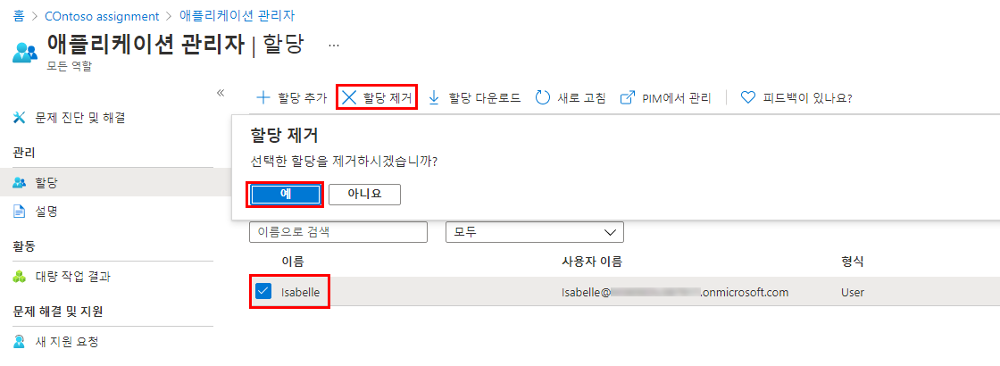

---
lab:
    title: '01 - 사용자 역할 관리'
    learning path: '01'
    module: '모듈 01 - ID 관리 솔루션 구현'
---

# 랩 01: 사용자 역할 관리

## 랩 시나리오

귀사는 최근에 애플리케이션 관리자 업무를 맡을 새로운 직원을 채용했습니다. 새로운 사용자를 생성하고 적절한 역할을 할당해야 합니다.

#### 예상 시간: 10분

## Azure 계정을 만들고 Azure Active Directory Premium P2 평가판 라이선스를 추가합니다.

연습의 작업과 학습 경로의 연습을 수행하려면 Azure 평가판 계정에 사용하거나 가입할 수 있도록 Azure를 구독해야 합니다. Azure 구독이 이미 있는 경우 이 작업을 건너뛰고 다음 작업을 계속할 수 있습니다.

1. 웹 브라우저에서 [https://azure.microsoft.com/free](https://azure.microsoft.com/free)로 이동합니다.

1. 페이지를 아래로 스크롤하여 사용 가능한 혜택과 무료 서비스에 대해 자세히 알아보세요.

1. **무료로 시작**을 선택합니다.

1. 마법사를 사용하여 Azure 평가판 구독에 가입합니다.

1. 일부 연습을 완료하려면 Azure AD P2 라이선스가 필요합니다. 직접 생성한 조직에서 **Azure Active Directory**를 검색한 후 선택합니다.

1. 왼쪽 탐색 메뉴에서 **시작**을 선택합니다.

1. Azure AD 시작에서 **Azure AD Premium 평가판 받기**를 선택합니다.

1. 활성화 창의 **AZURE AD PREMIUM P2**에서 **평가판**을 선택하고 **활성화**를 선택합니다.

1. 왼쪽의 탐색 메뉴에서 **개요**를 선택합니다.

1. 조직 이름 아래에 Azure AD Premium P2가 표시될 때까지 브라우저를 새로 고칩니다. 몇 분 정도 걸릴 수 있습니다.

1. 필요한 기능을 사용할 수 없는 문제가 발생하는 경우 로그아웃하고 Microsoft Azure에 다시 로그인해야 할 수 있습니다.

## 새 사용자 추가

이제 사용자 계정을 만들어 봅시다.

1. 전역 관리자로 [https://portal.azure.com](https://portal.azure.com)에 로그인합니다.

1. **Azure Active Directory**를 검색한 후 선택합니다.

1. 왼쪽 탐색 메뉴의 **관리**에서 **사용자 > 새 사용자** 를 선택합니다.

1. 다음 정보를 사용하여 사용자를 생성합니다.

    | **설정**| **값**|
    | :--- | :--- |
    | 사용자 이름| Chris|
    | 이름| 크리스 그린(Chris Green)|
    | First name| Chris|
    | Last name| Green|
    | 암호| Pass@word1|

1. **만들기**를 선택합니다. 이제 사용자가 만들어지고 조직에 등록됩니다.

## 사용자에게 역할 할당

Azure Active Directory (AD)를 사용하여 제한된 관리자를 지정하여 권한이 낮은 역할에서 ID 작업을 관리할 수 있습니다. 사용자 추가 또는 변경, 관리 역할 할당, 사용자 암호 재설정, 사용자 라이선스 관리 및 도메인 이름 관리와 같은 작업을 수행하도록 관리자를 지정할 수 있습니다.

1. Azure Active Directory 모든 사용자 블레이드에서 **Chris Green**을 선택합니다.

1. **사용자의 프로필** 페이지에서 **할당된 역할**을 선택합니다. **할당된 역할** 페이지가 표시됩니다.

1. **할당 추가**를 선택하고, **애플리케이션 관리자** 역할을 선택하고, **추가**를 선택합니다.

    

새로 할당된 애플리케이션 관리자 역할이 사용자의 **할당된 역할** 페이지에 표시됩니다.

## 역할 할당 제거

사용자의 역할 할당을 제거해야 하는 경우 **할당된 역할** 페이지에서 제거할 수도 있습니다.

1. **Azure Active Directory**에서 **사용자**를 선택한 후, 역할 할당을 제거할 사용자를 선택합니다. 예를 들면 *Chris Green*을 선택합니다.

1. **할당된 역할**을 선택하고 제거하려는 역할의 이름을 선택합니다.

1. 역할에서 제거할 사용자에 대한 확인란을 선택하고 **할당 제거**를 선택합니다.

    

애플리케이션 관리자 역할이 사용자에게서 제거되고 더 이상 **Alain Charon – 할당된 역할** 페이지에 표시되지 않습니다.

