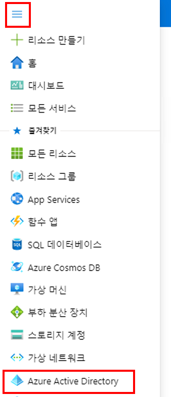

---
lab:
    title: '02 - 테넌트 속성 사용'
    learning path: '01'
    module: '모듈 01 - ID 관리 솔루션 구현'
---

# 랩 02: 테넌트 속성 사용

## 랩 시나리오

테넌트와 연관된 다양한 속성을 식별하고 업데이트해야 합니다.

#### 예상 시간: 10분

## 테넌트 표시 이름 변경

1. [https://portal.azure.com](https://portal.azure.com)으로 이동한 후 해당 디렉터리에 대한 전역 관리자 계정을 사용하여 로그인합니다.

1. **포털 표시 메뉴** 햄버거 아이콘을 선택하고 **Azure Active Directory**를 선택합니다.

    

1. 왼쪽 창의 관리 섹션에서 **속성**을 선택합니다.

1. **이름** 상자에서 테넌트 이름을 변경합니다. 예를 들어 Contoso 마케팅 회사를 Contoso Marketing Company 2로 변경할 수 있습니다.

1. **저장**을 선택하여 테넌트 속성을 업데이트합니다.

## 테넌트와 연결된 국가 또는 지역 찾기

1. **Azure Active Directory** 블레이드의 관리 섹션에서 **속성**을 선택합니다.

1. **테넌트 속성**에서 **국가 또는 지역**을 찾아 정보를 검토합니다.

    > [!중요]
    > 테넌트가 생성되면 국가 또는 지역은 해당 시간에 지정됩니다. 이 설정은 나중에 변경할 수 없습니다.

## 테넌트와 연관된 위치 찾기

국가 또는 지역은 Azure Active Directory 속성 블레이드에서 찾을 수 있는 것처럼 위치 정보입니다.

1. **속성** 블레이드의 **테넌트 속성**에서 **위치**를 찾아서 정보를 검토합니다.

    

## 테넌트 ID 찾기

Azure 구독은 Azure Active Directory (Azure AD)와 트러스트 관계가 있습니다. Azure AD는 구독에 대한 사용자, 서비스, 디바이스를 인증하는 데 신뢰할 수 있습니다. 각 구독에는 연결된 테넌트 ID가 있으며, 구독에 대한 테넌트 ID를 찾을 수 있는 몇 가지 방법이 있습니다.

1. **Azure Active Directory** 블레이드의 관리 섹션에서 **속성**을 선택합니다.

1. **테넌트 속성**에서 **테넌트 ID**를 찾습니다. 고유한 테넌트 식별자입니다.

    

## 기술 담당자를 변경하고 전역 개인 정보 보호 연락처, 개인정보처리방침 URL 등의 개인 정보를 Azure AD에 추가

전역 개인 정보 보호 연락처와 조직의 개인정보처리방침을 모두 추가하는 것이 좋습니다. 그러면 내부 직원과 외부 게스트가 정책을 검토할 수 있습니다. 개인정보처리방침이 고유하게 생성되고 각 비즈니스에 맞게 조정되기 때문에 도움말은 변호사에게 문의하는 것이 좋습니다.

    > [!참고]
    > 개인 데이터 보기 또는 삭제에 대한 자세한 내용은 [https://docs.microsoft.com/microsoft-365/compliance/gdpr-dsr-azure](https://docs.microsoft.com/microsoft-365/compliance/gdpr-dsr-azure)를 참조하세요. GDPR에 대한 자세한 내용은 [https://servicetrust.microsoft.com/ViewPage/GDPRGetStarted](https://servicetrust.microsoft.com/ViewPage/GDPRGetStarted)를 참조하세요.

Azure AD의 **속성** 영역에 조직의 개인 정보를 추가합니다. 속성 영역에 액세스하고 개인 정보를 추가하려면:

1. **Azure Active Directory** 블레이드의 관리 섹션에서 **속성**을 선택합니다.

    

1. 직원의 개인 정보를 추가합니다.

- **기술 담당자**. 조직 내에서 기술 담당자에게 문의하기 위해 사용자의 이메일 주소를 입력합니다.

- **전역 개인 정보 보호 연락처**. 개인 데이터 개인 정보에 대한 질문을 문의하기 위해 사용자의 이메일 주소를 입력합니다. 이 사용자는 데이터 위반이 발생하는 경우 Microsoft에서 연락할 사람이기도 합니다. 여기에 나열된 사용자가 없는 경우 Microsoft에서는 전역 관리자에게 연락합니다.

- **개인정보처리방침 URL**. 조직이 내부 및 외부 게스트의 데이터 개인 정보를 모두 처리하는 방법을 설명하는 조직의 문서에 대한 링크를 입력합니다.

    > [!중요]
    > 고유한 개인정보취급방침 또는 개인 정보 연락처를 포함하지 않는 경우 외부 게스트는 검토 권한 상자에 "\<조직 이름\>에서는 검토할 해당 약관에 대한 링크를 제공하지 않습니다"라는 텍스트를 보게 됩니다. 예를 들어 게스트 사용자는 B2B 협업을 통해 조직에 액세스하는 초대를 받을 때 이 메시지를 확인하게 됩니다.

    

1. **저장**을 선택합니다.
