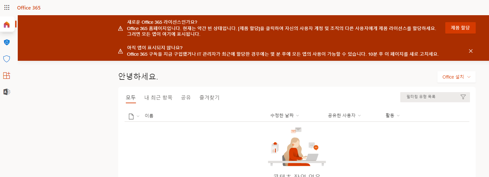
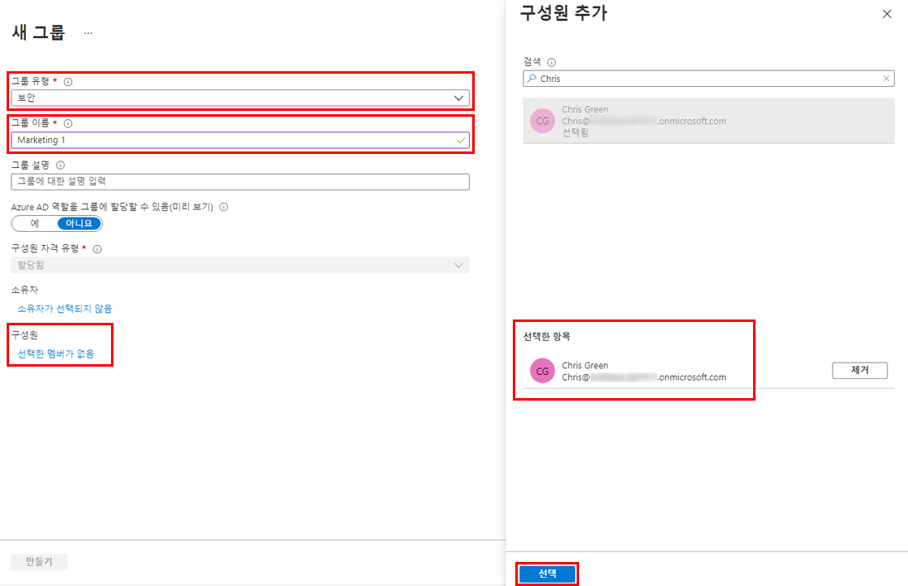
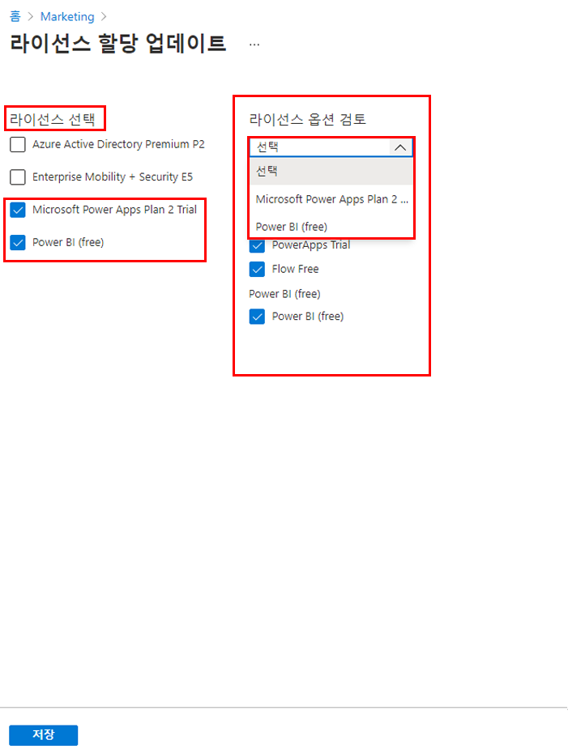
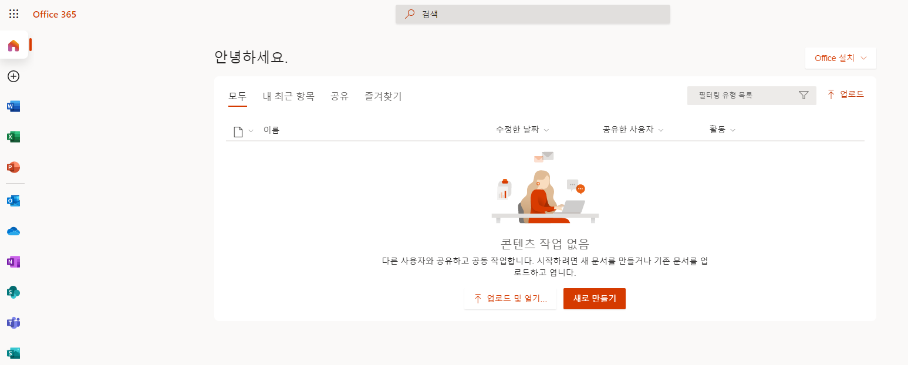

---
lab:
    title: '03 - 그룹 구성원 자격을 사용하여 라이선스 할당'
    learning path: '01'
    module: '모듈 02 - ID 생성, 구성 및 관리'
---

# 랩 03: 그룹 구성원 자격을 사용하여 라이선스 할당

## 랩 시나리오

조직에서 Azure AD의 보안 그룹을 사용하여 라이선스를 관리하기로 결정했습니다. 새로운 보안 그룹을 구성하고, 해당 그룹에 라이선스를 할당하고, 그룹 구성원 라이선스가 업데이트되었는지 확인해야 합니다.

#### 예상 소요 시간: 10분

## 연습 1 - 보안 그룹 만들기 및 사용자 추가

### 작업 1 - Delia Dennis에게 Office 365 액세스 권한이 있는지 확인

1. 브라우저 창을 시작합니다.
2. [https://www.office.com](https://www.office.com)에 연결합니다.
3. 로그인을 클릭하고 Delia Dennis로 연결합니다.

    | **설정**| **값**|
    | :--- | :--- |
    | 사용자 이름 | DeliaD@ <<Azure 도메인>>|
    | 암호| pass@word123|

4. Office.com 웹 사이트에 연결은 되지만 라이선스가 없다는 메시지가 표시됩니다.

    
    
5. 브라우저 창을 닫습니다.

### 작업 2 - Azure Active Directory에서 보안 그룹 만들기

1. [https://portal.azure.com/#blade/Microsoft_AAD_IAM/ActiveDirectoryMenuBlade/Overview]( https://portal.azure.com/#blade/Microsoft_AAD_IAM/ActiveDirectoryMenuBlade/Overview)로 이동합니다.

2. 왼쪽 탐색 영역의 **관리**에서 **그룹**을 선택합니다.
3. 그룹 블레이드의 메뉴에서 **새 그룹**을 선택합니다.
4. 다음 정보를 사용하여 그룹을 생성합니다.

    | **설정**| **값**|
    | :--- | :--- |
    | 그룹 유형| 보안|
    | 그룹 이름| sg-SC300-O365|
    | `구성원 자격 유형| 할당됨|
    | 소유자| *자신의 관리자 계정을 그룹 소유자로 할당*|

5. 구성원 아래에서 **선택한 멤버가 없음** 텍스트를 클릭합니다.
6. 사용자 목록에서 **Delia Dennis**를 선택합니다.
7. **선택** 단추를 클릭합니다.

    

8. **만들기** 단추를 클릭합니다.
9. 만들기가 완료되면 **sg-SC300-O365** 그룹이 **모든 그룹** 목록에 표시되는지 확인합니다.

## 작업 3 - 그룹에 라이선스 할당

1. **모든 그룹** 목록에서 **sg-SC300-O365**를 선택합니다.
2. 마케팅 블레이드의 **관리**에서 **라이선스**를 선택합니다.
3. 메뉴에서 **+ 할당**을 선택합니다.
4. 라이선스 할당 업데이트 블레이드의 **라이선스 선택**에서 사용 가능한 라이선스 목록을 검토한 후 **Office 365 E3**의 체크박스를 선택합니다.

    **팁** - 여러 라이선스를 선택한 경우 라이선스 옵션 검토 메뉴를 사용하여 특정 라이선스를 선택하고 해당 라이선스에 대한 라이선스 옵션을 볼 수 있습니다.

    

6. **저장**을 선택합니다.

### 작업 4 - Office 365 라이선스 확인

1. 브라우저 창을 시작합니다.
2. [https://www.office.com](https://www.office.com)에 연결합니다.
3. 로그인을 클릭하고 Delia Dennis로 연결합니다.

    | **설정**| **값**|
    | :--- | :--- |
    | 사용자 이름 | DeliaD@ <<Azure 도메인>>|
    | 암호| pass@word123|

4. Office.com 웹 사이트에 연결하여 라이선스 관련 메시지가 없는지 확인해야 합니다. 모든 Office 애플리케이션은 왼쪽에서 사용할 수 있습니다.

    
    
5. 브라우저 창을 닫습니다.
    
