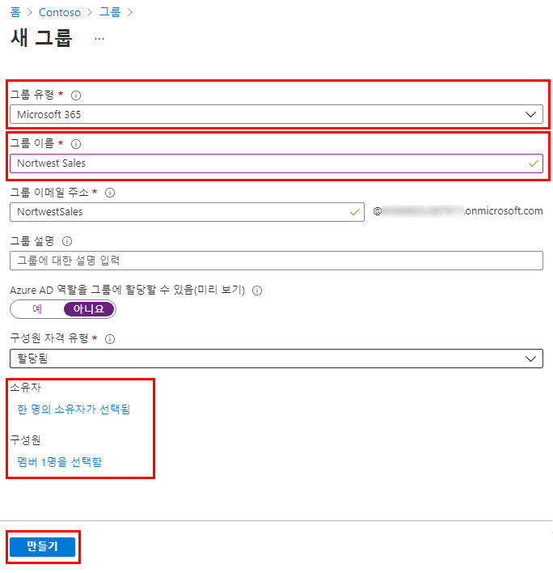

---
lab:
    title: '05 - Azure AD에 그룹 추가'
    learning path: '01'
    module: '모듈 02 - ID 생성, 구성 및 관리'
---

# 랩 05: Azure AD에 그룹 추가

## 랩 시나리오

Azure AD 관리자의 업무 중 하나는 다양한 유형의 그룹을 만드는 것입니다. 조직의 영업부를 위해 새로운 Microsoft 365 그룹을 만들어야 합니다.

#### 예상 시간: 5분

## Azure Active Directory에서 Microsoft 365 그룹 생성

1. [https://portal.azure.com/#blade/Microsoft_AAD_IAM/ActiveDirectoryMenuBlade/Overview]( https://portal.azure.com/#blade/Microsoft_AAD_IAM/ActiveDirectoryMenuBlade/Overview)로 이동합니다.

1. 왼쪽 탐색 영역의 **관리**에서 **그룹**을 선택합니다.

1. 그룹 블레이드의 메뉴에서 **새 그룹**을 선택합니다.

1. 다음 정보를 사용하여 그룹을 생성합니다.

    | **설정**| **값**|
    | :--- | :--- |
    | 그룹 유형| Microsoft 365|
    | 그룹 이름| 북서부 판매액|
    | 구성원 자격 유형| 할당됨|
    | 소유자| *자신의 관리자 계정을 그룹 소유자로 할당*|
    | 구성원| **Alex Wilber** 및 **Bianca Pisani**|

    

1. 완료되면 이름이 **Northwest sales**라는 그룹이 **모든 그룹** 목록에 표시되는지 확인합니다.
