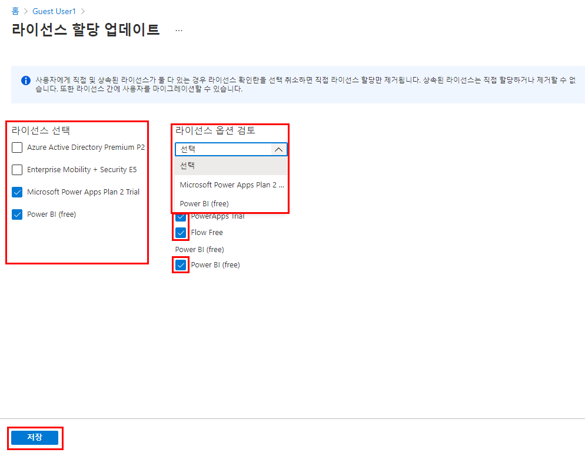

---
lab:
    title: '07 - 사용자 계정 라이선스 할당 변경'
    learning path: '01'
    module: '모듈 02 - ID 생성, 구성 및 관리'
---

# 랩 07: 사용자 계정 라이선스 할당 변경

## 랩 시나리오

조직 내 일부 사용자 계정에서 할당된 라이선스에 포함된 모든 사용 가능 제품이 제공되지 않거나, 라이선스 할당에 대한 업데이트나 추가가 필요합니다. Azure AD에서 사용자 계정의 라이선스 할당을 업데이트할 수 있는지 확인해야 합니다.

#### 예상 시간: 5분

## 연습 1 - 사용자 계정에 Windows 10 라이선스 추가

### 작업 1 - Azure Active Directory에서 사용이 허가되지 않은 사용자 찾기

1. [https://portal.azure.com/#blade/Microsoft_AAD_IAM/ActiveDirectoryMenuBlade/Overview]( https://portal.azure.com/#blade/Microsoft_AAD_IAM/ActiveDirectoryMenuBlade/Overview)로 이동합니다.

2. 왼쪽 탐색 영역의 **관리**에서 **사용자**를 선택합니다.

3. 사용자 블레이드에서 검색 상자에 **Raul**을 입력합니다.

4. **Raul Razo**를 클릭합니다.
5. Raul의 프로필을 검토하여 사용 위치가 설정되어 있음을 확인합니다.

    **경고** - 라이선스를 할당하려는 사용자에게는 사용 위치가 할당되어 있어야 합니다.

6. 왼쪽 메뉴에서 **라이선스** 메뉴를 클릭합니다.
7. "라이선스 할당을 찾을 수 없습니다."라는 메시지가 표시되는지 확인합니다.

### 작업 2 - 사용자 라이선스 할당 업데이트

1. [https://portal.azure.com/#blade/Microsoft_AAD_IAM/ActiveDirectoryMenuBlade/Overview]( https://portal.azure.com/#blade/Microsoft_AAD_IAM/ActiveDirectoryMenuBlade/Overview)로 이동합니다.

2. 왼쪽 탐색 영역의 **관리**에서 **사용자**를 선택합니다.

3. 사용자 블레이드에서 **Raul Razo**를 선택합니다.

4. 왼쪽 탐색 영역에서 **라이선스**를 선택합니다.

5. **+ 할당** 단추를 선택합니다. 

6. 라이선스 할당 업데이트 블레이드에서 **Windows 10 Enterprise E3** 라이선스의 체크박스를 선택합니다.

    

7. 완료되면 **저장**을 선택합니다.
8. 화면 위쪽에서 `Home > Contoso Marketing > User >` **Raul Razo**를 클릭합니다.
9. 라이선스가 할당되었음을 확인합니다.
