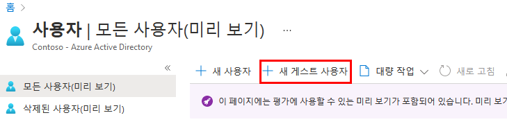

---
lab:
    title: '09 - 디렉터리에 게스트 사용자 추가'
    learning path: '01'
    module: '모듈 03 – 외부 ID 구현 및 관리'
---

# 랩 09: 디렉터리에 게스트 사용자 추가

## 랩 시나리오

귀사는 여러 공급업체와 협력하고 있으며, 때로는 일부 공급업체 계정을 디렉터리에 게스트로 추가해야 합니다.

#### 예상 시간: 5분

## 디렉터리에 게스트 사용자 추가

1. 제한된 관리자 디렉터리 역할 또는 게스트 초대자 역할에 할당된 사용자로 [https://portal.azure.com](https://portal.azure.com)에 로그인합니다.

1. **Azure Active Directory**를 선택합니다.

1. **관리**에서 **사용자**를 선택합니다.

1. **새 게스트 사용자**를 선택합니다.

    

1. 새 사용자 페이지에서 **사용자 초대**를 선택하고 자신의 정보를 게스트 사용자 정보로 추가합니다.

    > [!참고]
    > 그룹 메일 주소는 지원되지 않습니다. 개인용 메일 주소를 입력하세요. 또한 일부 이메일 공급 기업에서는 수신함 필터링 등을 지원하기 위해 사용자가 이메일 주소에 더하기 기호 (+) 및 추가 텍스트를 추가하는 것을 허용합니다. 그러나 Azure AD는 현재 메일 주소에서 더하기 기호를 지원하지 않습니다. 배달 문제를 방지하려면 @ 기호 뒤에 오는 모든 문자 및 더하기 기호를 생략합니다.

1. 완료되면 **초대**를 선택합니다.

1. 사용자 블레이드에서 내 계정이 나열되어 있는지 확인하고 **사용자 유형** 열에서 **게스트**가 표시되는지 확인합니다.

초대를 보내고 나면 해당 사용자 계정이 디렉터리에 게스트로 자동으로 추가됩니다.
