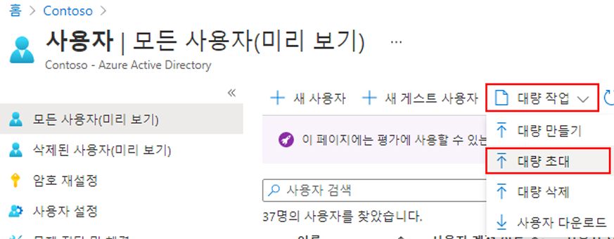
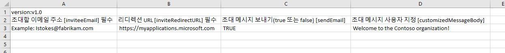
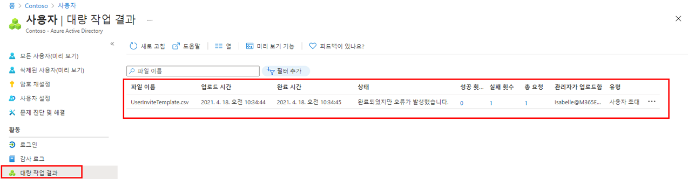

---
lab:
    title: '10 - 게스트 사용자 일괄 초대'
    learning path: '01'
    module: '모듈 03 - 외부 ID 구현 및 관리'
---

# 랩 10: 게스트 사용자 일괄 초대

## 랩 시나리오

최근에 다른 회사와의 파트너십이 체결되었습니다. 일단은 파트너 회사의 직원들이 게스트로 추가될 것입니다. 여러 게스트 사용자를 한 번에 가져올 수 있는지 확인해야 합니다.

#### 예상 시간: 10분

## 게스트 사용자 일괄 초대

1. 전역 관리자로 [https://portal.azure.com](https://portal.azure.com)에 로그인합니다.

1. 탐색 창에서 **Azure Active Directory**를 선택합니다.

1. **관리**에서 **사용자**를 선택합니다.

1. 사용자 블레이드의 메뉴에서 **대량 작업 > 대량 초대** 를 선택합니다.

     

1. 대량 초대 사용자 창에서 초대 속성을 사용하여 샘플 CSV 템플릿으로 **다운로드**를 선택합니다.

1. 편집기를 사용하여 CSV 파일을 보려면 템플릿을 검토합니다.

1. .csv 템플릿을 열고 각 게스트 사용자에 대한 줄을 추가합니다. 필요한 값은 다음과 같습니다.

    - **초대할 이메일 주소** - 초대를 받을 사용자

    - **리디렉션 url** - 초대를 승인한 후 초대된 사용자가 전달되는 URL

    

1. 파일을 저장합니다.

1. 사용자 일괄 초대 페이지의 **csv 파일 업로드**에서 해당 파일을 찾습니다.

파일을 선택하면 .csv 파일의 유효성 검사가 시작됩니다.

1. 파일 내용의 유효성을 검사한 후에 **파일을 업로드했습니다**가 표시됩니다. 오류가 있는 경우 해당 오류를 해결해야 작업을 제출할 수 있습니다.

    

1. 파일이 유효성 검사를 통과하면 **제출**을 선택하여 초대를 추가하는 Azure 대량 작업을 시작합니다.

1. 작업 상태를 보려면 **각 작업의 상태를 보려면 여기를 클릭**을 선택합니다. 또는 작업 섹션에서 **대량 작업 결과**를 선택할 수 있습니다. 대량 작업 내의 각 줄 항목에 대한 자세한 내용을 보려면 **# Success**, **# Failure** 또는 **Total Requests** 열의 값을 선택합니다. 오류가 발생하면 실패 이유가 나열됩니다.

    

1. 작업이 완료 되 면 대량 작업이 성공했다는 알림이 표시됩니다.
