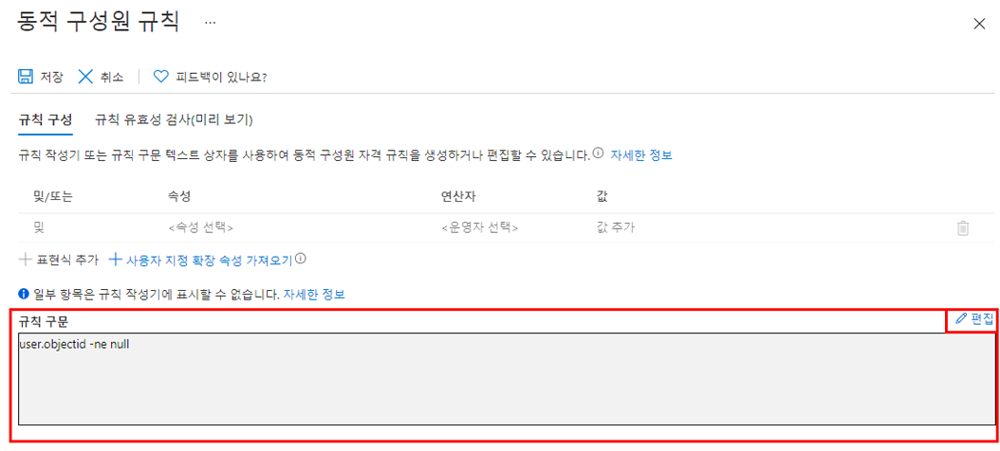

---
lab:
    title: '11 - 동적 그룹 작업'
    learning path: '01'
    module: '모듈 03 - 외부 ID 구현 및 관리'
---

# 랩 11: 동적 그룹 작업

## 랩 시나리오

회사가 성장함에 따라 수동으로 그룹을 관리하는 것은 시간이 너무 오래 걸릴 수 있습니다. 디렉터리를 표준화한 이후에는 동적 그룹을 활용할 수 있습니다. 실제로 동적 그룹을 생성할 준비가 되었는지 확인하기 위해 새로운 동적 그룹을 만들어봐야 합니다.

#### 예상 소요 시간: 10분

## 연습 1 - 모든 사용자를 구성원으로 사용하여 동적 그룹 만들기

### 작업 1 - 동적 그룹 만들기

1. 테넌트에서 전역 관리자 또는 사용자 관리자 역할이 할당된 계정으로 [https://portal.azure.com](https://portal.azure.com) 에 로그인합니다.

2. **Azure Active Directory**를 선택합니다.

3. **관리**에서 **그룹**을 선택한 다음 **새 그룹**을 선택합니다.

4. 새 그룹 페이지의 **그룹 유형**에서 **보안**을 선택합니다.

5. **그룹 이름** 상자에 **SC300-myDynamicGroup**을 입력합니다.

6. **구성원 자격 유형** 메뉴를 선택하고 **동적 사용자**를 선택합니다.

7. **동적 사용자 구성원**에서 **동적 쿼리 추가**를 선택합니다.

8. **규칙 구문** 상자 오른쪽 위에 있는 **편집**을 선택합니다.

9. 규칙 구문 편집 창에서 **규칙 구문** 상자에 다음 식을 입력합니다.

    ```powershell
    user.objectid -ne null
    ```

    **경고** - `user.objectid`는 대/소문자까지 정확하게 일치하도록 입력해야 합니다.

10. **확인**을 선택합니다. 규칙은 규칙 구문 상자에 나타납니다.

    

11. **저장**을 선택합니다. 새 동적 그룹에는 이제 구성원 사용자뿐만 아니라 B2B 게스트 사용자도 포함됩니다.

12. 새 그룹 페이지에서 **만들기**를 선택하여 그룹을 만듭니다.

### 작업 2 - 구성원이 추가되었는지 확인

1. **홈**에서 `Azure Active Directory`를 클릭합니다.
2. **Azure Active Directory**를 시작합니다.
3. **관리** 메뉴에서 **그룹**을 클릭합니다.
4. 필터 상자에 **SC300**을 입력하면 새로 만든 그룹이 목록에 표시됩니다.
5. **SC300-myDynamicGroup**을 클릭하여 그룹을 엽니다.
6. 그룹의 **직접 구성원** 수가 30명이 넘는다는 메시지가 표시됩니다.
7. **관리** 메뉴에서 **구성원**을 클릭합니다.
8. 구성원을 검토합니다.

### 작업 3 - 다른 규칙 사용해 보기

1. **게스트** 사용자만 포함된 그룹을 만들어 봅니다.
   - (user.objectid -ne null) 및 (user.userType -eq "Guest") 식을 사용하면 됩니다.

2. Azure AD 사용자의 **구성원**만 포함된 그룹을 만들어 봅니다.
   - (user.objectid -ne null) 및 (user.userType -eq "Member") 식을 사용하면 됩니다.
