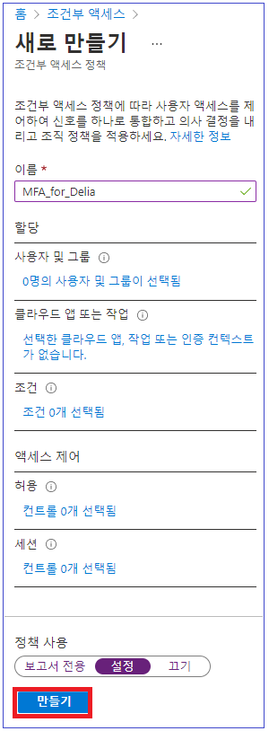

---
lab:
    title: '12 - Azure AD Multi-Factor Authentication 사용'
    learning path: '02'
    module: '모듈 01 - Azure Multi-Factor Authentication 계획 및 구현'
---

# 랩 12 - Azure AD Multi-Factor Authentication 사용

## 랩 시나리오

조직의 보안을 강화하기 위해 Azure Active Directory에 다단계 인증을 사용하라는 지시를 받았습니다.

#### 예상 시간: 10분

>[!중요]
>이 연습을 수행하려면 Azure AD Premium이 필요합니다. 30일 평가판으로 이 기능을 사용해보거나, 아래 지침을 읽고 흐름을 파악할 수 있습니다.

## Multi-Factor Authentication 옵션 구성

1. [https://portal.azure.com](https://portal.azure.com)으로 이동한 후 해당 디렉터리에 대한 전역 관리자 계정을 사용하여 로그인합니다.

1. 검색 기능을 사용하고 **multi-factor** 를 검색합니다.

1. 검색 결과에서 **Multi-Factor Authentication** 을 선택합니다.

1. 시작 페이지의 **구성**에서 **추가 클라우드 기반 MFA 설정**을 선택합니다.

    

1. 새 브라우저 창에서 Azure 사용자 및 서비스 설정의 옵션을 볼 수 있습니다.

    

    여기서 지원되는 인증 방법을 선택합니다. 위 화면에서는 모든 방법이 선택되었습니다.

    사용자가 다단계 인증을 지원하지 않는 앱에 대해 고유한 계정 암호를 만들 수 있도록 여기서 앱 암호를 사용하거나 사용하지 않도록 설정할 수도 있습니다. 이 기능을 사용하면 사용자가 해당 앱과 관련된 다른 암호를 사용하여 Azure AD ID에 인증할 수 있습니다.

## MFA에 대한 조건부 액세스 규칙 설정

다음으로, 네트워크의 특정 앱에 액세스하는 게스트 사용자에 대해 MFA를 적용하는 조건부 액세스 정책 규칙을 설정하는 방법을 살펴보겠습니다.

1. Azure Portal로 다시 전환하고 **Azure Active Directory** > **보안** > **조건부 액세스**를 선택합니다.

1. 메뉴에서 **새 정책**을 선택합니다.

    

1. 정책 이름(예: **All guests**)을 지정합니다.

1. **사용자 및 그룹**을 선택합니다.

    - **사용자 및 그룹 선택**을 선택합니다.  
    - 모든 게스트에 이 설정을 적용하려면 **모든 게스트 및 외부 사용자** 확인란을 선택합니다.  
    - **완료**를 선택합니다.  

1. **클라우드 앱 또는 작업**을 선택합니다.

    - **앱 선택**을 선택합니다.  
    - Azure AD MFA를 사용하도록 설정할 앱(예: Visual Studio App Center)을 선택합니다.  
    - **선택**과 **완료**를 차례로 선택합니다.

1. 조건 섹션을 검토합니다.

    - **위치**를 선택하고 **임의의 위치**에 대해 구성합니다.

1. **액세스 제어**에서 **권한 부여**를 선택한 다음 **액세스 권한 부여**가 선택되었는지 확인합니다.

1. **다단계 인증 요구** 확인란을 선택하여 MFA를 적용합니다.

1. **선택**을 선택합니다.

1. **정책 사용 설정**을 **설정**으로 합니다.

1. **생성**을 선택하여 정책을 만듭니다.

    

    이제 선택한 애플리케이션에서 MFA가 사용하도록 설정되었습니다. 다음에 게스트가 해당 앱에 로그인하려고 하면 MFA에 등록하라는 메시지가 표시됩니다.

## 암호에 대해 Azure AD MFA 구성

마지막으로, 사용자 계정에 대해 MFA를 구성하는 방법을 살펴봅시다. 다단계 인증 설정에 액세스하는 또 다른 방법입니다.

1. Azure Portal에서 Azure Active Directory 대시보드로 다시 전환합니다.

1. **사용자**를 선택합니다.

1. 사용자 창의 맨 위에 있는 **Multi-Factor Authentication** 을 선택합니다.

    

    사용자를 선택하고 오른쪽에 있는 빠른 단계를 사용하여 사용자별로 MFA를 사용하거나 사용하지 않도록 설정할 수 있습니다.

    

1. **서비스 설정**을 선택합니다.  
    앞에서 본 것과 동일한 전역 MFA 옵션이 표시됩니다. 이 내용을 좀 더 자세히 살펴봅시다.
