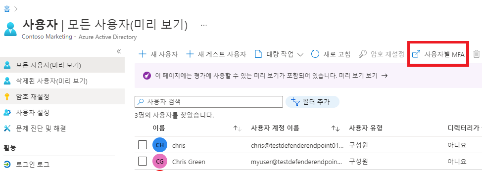

---
lab:
    title: '12 - Azure AD Multi-Factor Authentication 사용'
    learning path: '02'
    module: '모듈 01 - Azure Multi-Factor Authentication 계획 및 구현'
---

# 랩 12 - Azure AD Multi-Factor Authentication 사용

## 랩 시나리오

조직의 보안을 강화하기 위해 Azure Active Directory에 다단계 인증을 사용하라는 지시를 받았습니다.

#### 예상 시간: 15분

**중요** - 이 연습을 수행하려면 Azure AD Premium 라이선스가 필요합니다.

## 연습 1 - Azure에서 다단계 인증을 검토하고 사용하도록 설정

### 작업 1 - Azure Multi-Factor Authentication 옵션 검토

1. [https://portal.azure.com](https://portal.azure.com)으로 이동한 후 해당 디렉터리에 대한 전역 관리자 계정을 사용하여 로그인합니다.

2. 검색 기능을 사용하고 **multi-factor**를 검색합니다.

3. 검색 결과에서 **Multi-Factor Authentication**을 선택합니다.

4. 시작 페이지의 **구성**에서 **추가 클라우드 기반 MFA 설정**을 선택합니다.

    

5. 새 브라우저 창에서 Azure 사용자 및 서비스 설정의 MFA 옵션을 볼 수 있습니다.

    

    여기서 지원되는 인증 방법을 선택합니다. 위 화면에서는 모든 방법이 선택되었습니다.

    사용자가 다단계 인증을 지원하지 않는 앱에 대해 고유한 계정 암호를 만들 수 있도록 여기서 앱 암호를 사용하거나 사용하지 않도록 설정할 수도 있습니다. 이 기능을 사용하면 사용자가 해당 앱과 관련된 다른 암호를 사용하여 Azure AD ID에 인증할 수 있습니다.

### 작업 2 - Delia Dennis에게 적용할 MFA용 조건부 액세스 규칙 설정

다음으로, 네트워크의 특정 앱에 액세스하는 게스트 사용자에 대해 MFA를 적용하는 조건부 액세스 정책 규칙을 설정하는 방법을 살펴보겠습니다.

1. Azure Portal로 다시 전환하고 **Azure Active Directory** > **보안** > **조건부 액세스**를 선택합니다.

2. 메뉴에서 **새 정책**을 선택합니다.

    

3. 정책 이름(예: **MFA_for_Delia**)을 지정합니다.

4. 할당에서 **사용자 및 그룹**을 선택합니다.

    - **0명의 사용자 및 그룹이 선택됨**을 선택합니다.  
    - 오른쪽 화면에서 **사용자 및 그룹 선택** 체크박스를 선택하여 구성합니다.
    - **사용자 및 그룹**을 선택합니다(사용 가능한 사용자가 오른쪽에 채워짐).
    - 사용자 목록에서 **Delia Dennis**를 선택한 후에 **선택** 단추를 선택합니다.

5. **클라우드 앱 또는 작업**을 선택합니다.

    - 드롭다운에서 **클라우드 앱**을 선택했는지 확인합니다.
    - 포함 아래에서 **모든 클라우드 앱**을 표시하고 계정이 잠길 수 있다는 경고 팝업을 확인합니다. 
    - 그런 다음 포함 아래에서 선택 옵션을 **앱 선택** 항목으로 변경합니다.
    - 새로 열리는 대화 상자에서 **Office 365**를 선택합니다.
        - **알림** - 이전 랩에서 Delia Dennis에게 Office 365 라이선스를 제공한 후 Delia Dennis로 로그인하여 라이선스가 작동하는지를 확인했습니다.
    - **선택**을 선택합니다.

6. 조건 섹션을 검토합니다.

    - **위치**를 선택하고 **임의의 위치**에 대해 구성합니다.

7. **액세스 제어**에서 **권한 부여**를 선택한 다음 **액세스 권한 부여**가 선택되었는지 확인합니다.

8. **다단계 인증 요구** 체크박스를 선택하여 MFA를 적용합니다.

9. **선택된 컨트롤이 모두 필요함**이 선택되어 있는지 확인합니다.

10. **선택**을 선택합니다.

11. **정책 사용 설정**을 **설정**으로 합니다.

12. **만들기**를 선택하여 정책을 만듭니다.

    

    이제 선택한 사용자 및 애플리케이션에 대해 MFA가 사용하도록 설정되었습니다. 다음에 게스트가 해당 앱에 로그인하려고 하면 MFA에 등록하라는 메시지가 표시됩니다.

### 작업 3 - Delia의 로그인 테스트

1. 새 InPrivate 브라우징 창을 엽니다.
2. https://www.office.com 에 연결합니다.
3. 로그인 옵션을 클릭합니다.
4. **DeliaD@** `<<your domain address>>`를 입력합니다.
5. 암호로는 **pass@word123**을 입력합니다.
6. 이 작업의 결과는 다음의 두 가지 중 하나입니다.  Authenticator 앱을 설치하고 MFA에 등록해야 한다는 메시지가 표시됩니다.  메시지에 따라 개인 휴대폰을 사용하여 해당 과정을 완료합니다.  참고 - 로그인 실패 메시지가 표시되고 이후 단계를 진행하는 방법을 선택할 수 있는 여러 가지 옵션이 제공될 수도 있습니다.  이 경우에는 **다시 시도** 옵션을 클릭합니다.

Delia용으로 만든 조건부 액세스 규칙으로 인해 Office 365 홈 페이지를 시작하려면 MFA를 진행해야 하기 때문입니다.

## 연습 2 - 로그인 시에 MFA를 진행해야 하도록 구성

### 작업 1 - Azure AD 사용자별 MFA 구성

마지막으로, 사용자 계정에 대해 MFA를 구성하는 방법을 살펴봅시다. 다단계 인증 설정에 액세스하는 또 다른 방법입니다.

1. Azure Portal에서 Azure Active Directory 대시보드로 다시 전환합니다.

2. **사용자**를 선택합니다.

3. 사용자 창의 맨 위에 있는 **사용자별 MFA**를 선택합니다.

    

4. 새 브라우저 탭/창이 열리고 다단계 인증 사용자 설정 대화 상자가 표시됩니다.

    사용자를 선택하고 오른쪽에 있는 빠른 단계를 사용하여 사용자별로 MFA를 사용하거나 사용하지 않도록 설정할 수 있습니다.

    

5. 확인 표시가 있는 **Adele Vance**를 선택합니다.
6. 빠른 단계 아래에서 **사용** 옵션을 선택합니다.
7. 알림 팝업이 표시되면 해당 내용을 확인하고 **다단계 인증 사용** 단추를 선택합니다.
8. **닫기**를 선택합니다.
9. 이제 Adele의 MFA 상태가 **사용**으로 표시됩니다.
10. **서비스 설정**을 선택하여 랩 앞부분에서 살펴본 MFA 설정 화면을 확인할 수 있습니다.
11. MFA 설정 탭을 닫습니다.

### 작업 2 - Adele로 로그인 시도

1. MFA 로그인 프로세스의 다른 예제를 확인하려는 경우 Adele로 로그인해 볼 수 있습니다.
