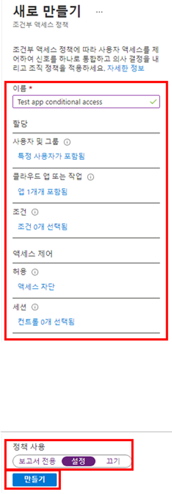
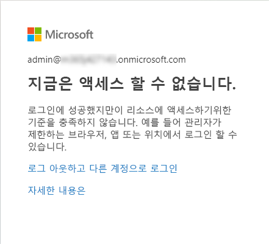

---
lab:
    title: '15 - 조건부 액세스 정책 구현 및 테스트'
    learning path: '02'
    module: '모듈 03 - 조건부 액세스 계획, 구현 및 관리'
---

# 랩 15 - 조건부 액세스 정책 구현 및 테스트

## 랩 시나리오

조직에서 내부 애플리케이션에 대한 사용자 액세스를 제한할 수 있어야 합니다. Azure Active Directory 조건부 액세스 정책을 배포해야 합니다.

#### 예상 소요 시간: 12분

## 연습 1 - DebraB의 Yammer 액세스를 차단하는 조건부 액세스 정책 설정

### 작업 1 - DebraB에게 Yammer 액세스 권한이 있는지 확인

1. 새 InPrivate 브라우저 창을 시작합니다.
2. [https://www.office.com](https://www.office.com)에 연결합니다. 
3. 메시지가 표시되면 DebraB로 로그인합니다.

    | 설정 | 값 |
    | :--- | :--- |
    | 사용자 이름 | **DebraB@** `<<your lab domain>>.onmicrosoft.com` |
    | 암호 | **pass@word123** |
    
4. Yammer 아이콘을 클릭하여 Yammer가 정상적으로 로드되는지 확인합니다.

## 작업 2 - 조건부 액세스 정책 만들기

Azure Active Directory 조건부 액세스는 리소스에 액세스 할 수 있는 사용자를 제어하는 상세 정책을 지정할 수 있는 Azure AD의 고급 기능입니다. 조건부 액세스를 사용하여 그룹, 디바이스 유형, 위치 및 역할과 같은 항목에 따라 사용자의 액세스를 제한하여 애플리케이션을 보호할 수 있습니다.

1. [https://portal.azure.com](https://portal.azure.com)으로 이동한 후 해당 디렉터리에 대한 전역 관리자 계정을 사용하여 로그인합니다.

2. 포털 메뉴를 열고 **Azure Active Directory**를 선택합니다.

3. Azure Active Directory 블레이드의 **관리**에서 **보안**을 선택합니다.

4. 보안 블레이드의 왼쪽 탐색 영역에서 **조건부 액세스**를 선택합니다.

5. 상단 메뉴에서 **+ 새 정책**을 선택합니다.

    

6. **이름** 상자에 **DebraB에 대해 Yammer 차단**을 입력합니다.

    **참고** - 이러한 명명 규칙을 사용하면 정책과 해당 기능을 빠르게 파악할 수 있습니다.

7. **할당**에서 **사용자 및 그룹**을 선택합니다.

8. 포함 탭에서 **사용자 및 그룹** 확인란을 선택합니다.

9. 선택 창에서 **DebraB** 계정을 선택한 다음 **선택**을 선택합니다.

10. **클라우드 앱 또는 작업**을 선택합니다.

11. **클라우드 앱**이 선택되어 있는지 확인하고 **앱 선택**을 선택합니다.

12. 선택 창에서 **Yammer**를 검색한 후 **Office 365 Yammer**를 선택하고 **선택**을 선택합니다.

13. **액세스 제어** 아래에서 **허용**을 선택합니다.

14. 허용 창에서 **액세스 차단**을 선택하고 **선택**을 선택합니다.

    **참고** - 이 정책은 연습에 대해서만 구성되며 조건부 액세스 정책을 신속하게 설명하는 데 사용됩니다.

15. **정책 사용**에서 **켜기**, **만들기**를 차례로 선택합니다.

    

## 작업 3 - 조건부 액세스 정책 테스트

조건부 액세스 정책을 테스트하여 예상대로 작동하는지 확인해야 합니다.

1. 새 'Inprivate' 브라우저 탭을 열고 [https://www.yammer.com/office365](https://www.yammer.com/office365)로 이동합니다.
     - 메시지가 표시되면 DebraB로 로그인합니다.

    | 설정 | 값 |
    | :--- | :--- |
    | 사용자 이름 | **DebraB@** `<<your lab domain>>.onmicrosoft.com` |
    | 암호 | **pass@word123** |
      
2. Microsoft Yammer에 액세스할 수 없도록 되어 있는지 확인합니다.

    

3. 로그인되어 있으면 탭을 닫고 1분 동안 기다렸다가 다시 시도합니다.
    
     **참고** - Yammer에 DebraB로 자동 로그인되면 수동으로 로그아웃해야 합니다.  Yammer에 자동으로 로그인되는 이유는 자격 증명/액세스가 캐시되었기 때문입니다.  로그아웃했다가 다시 로그인하면 Yammer 세션에서 액세스가 거부됩니다.

4. 탭을 닫고 조건부 액세스 블레이드로 돌아갑니다.

5. **Yammer 조건부 액세스** 정책을 선택합니다.

6. **정책 사용**에서 **끄기**를 선택한 다음, **저장**을 선택합니다.
