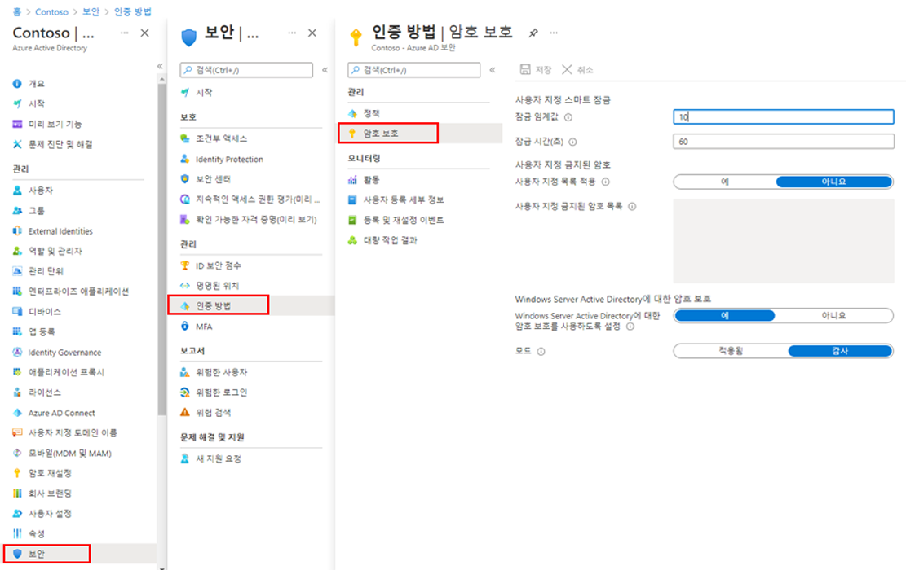

---
lab:
    title: '17 - Azure AD 스마트 잠금 값 관리'
    learning path: '02'
    module: '모듈 03 - 조건부 액세스 계획, 구현 및 관리'
---

# 랩 17 - Azure AD 스마트 잠금 값 관리

## 랩 시나리오

조직에 대한 추가 암호 보호 설정을 구성해야 합니다.

#### 예상 시간: 5분

## Azure AD 스마트 잠금 값 관리

조직의 요구 사항에 따라 Azure AD 스마트 잠금 값을 사용자 지정할 수 있습니다. 조직에 특수한 값이 있는 스마트 잠금 설정의 사용자 지정에는 Azure AD Premium P1 또는 사용자에 대한 높은 라이선스가 필요합니다.

1. [https://portal.azure.com](https://portal.azure.com)으로 이동한 후 해당 디렉터리에 대한 전역 관리자 계정을 사용하여 로그인합니다.

1. 포털 메뉴를 열고 **Azure Active Directory**를 선택합니다.

1. Azure Active Directory 블레이드의 **관리**에서 **보안**을 선택합니다.

1. 보안 블레이드의 왼쪽 탐색 영역에서 **인증 방법**을 선택합니다.

1. 왼쪽 탐색 영역에서 **암호 보호**를 선택합니다.

    

1. **암호 보호 설정의 잠금 기간(초)** 상자에서 값을 **120**으로 설정합니다.

1. **모드** 옆의 **적용**을 선택합니다.

1. 변경 내용을 저장합니다.

    **참고** - 스마트 잠금 임계값이 트리거되면 계정이 잠겨 있는 동안 다음 메시지가 나타납니다.
    - 권한 없는 사용을 방지하기 위해 계정이 일시적으로 잠겨 있습니다. 나중에 다시 시도하세요. 문제가 계속 발생하면 관리자에게 문의하세요.
