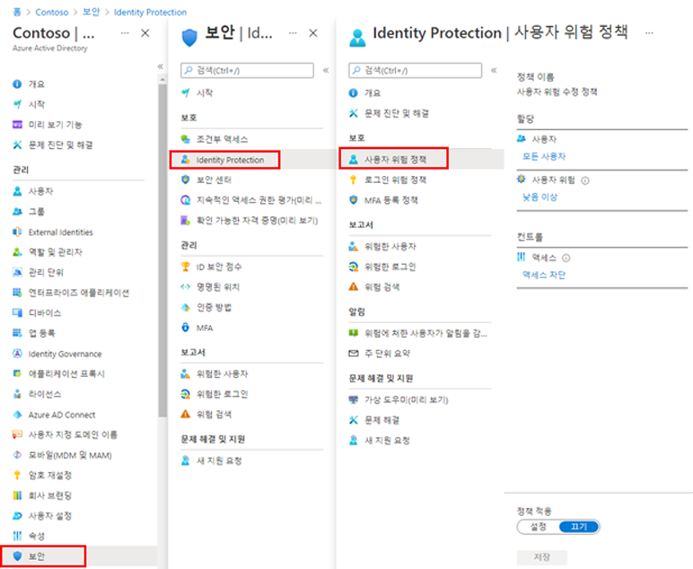

---
lab:
    title: '18 - 로그인 및 사용자 위험 정책 사용'
    learning path: '02'
    module: '모듈 04 - Azure AD ID 보호 관리'
---

# 랩 18 - 로그인 및 사용자 위험 정책 사용

## 랩 시나리오

추가적인 보안 대책으로 Azure AD 조직의 로그인 및 사용자 위험 정책을 사용하고 구성해야 합니다.

#### 예상 시간: 10분

## 사용자 위험 정책 사용

1. 전역 관리자 계정을 사용하여 [https://portal.azure.com]( https://portal.azure.com) 에 로그인합니다.

1. 포털 메뉴를 열고 **Azure Active Directory**를 선택합니다.

1. Azure Active Directory 블레이드의 **관리**에서 **보안**을 선택합니다.

1. 보안 블레이드의 왼쪽 탐색 영역에서 **ID 보호**를 선택합니다.

1. Identity Protection 블레이드의 왼쪽 탐색 영역에서 **사용자 위험 정책**을 선택합니다.

    

1. **할당**에서 **모든 사용자**를 선택하고 사용 가능한 옵션을 검토합니다.

1. 롤아웃을 제한하는 경우 **모든 사용자** 또는 **개인 및 그룹 선택**에서 선택할 수 있습니다.

1. 또한 정책에서 사용자를 제외하도록 선택할 수 있습니다.

1. **사용자 위험**에서 **낮음 이상**을 선택합니다.

1. 사용자 위험 창에서 **높음**을 선택한 다음, **완료**를 선택합니다.

1. **컨트롤** > **액세스**에서 **액세스 차단**을 선택합니다.

1. 액세스 창에서 사용 가능한 옵션을 검토합니다.

    **팁** - 액세스를 허용하고 암호 변경을 요구하는 것이 좋습니다.

1. **암호 변경 필요** 확인란을 선택한 다음, **완료**를 선택합니다.

1. **정책 적용**에서 **켜기**를 선택한 다음, **저장**을 선택합니다.

## 로그인 위험 정책 사용

1. ID 보호 블레이드의 왼쪽 탐색 영역에서 **로그인 위험 정책**을 선택합니다.

1. 사용자 위험 정책과 마찬가지로, 로그인 위험 정책을 사용자 및 그룹에 할당할 수 있으며 이를 사용하여 정책에서 사용자를 제외할 수 있습니다.

1. **로그인 위험**에서 **낮음 이상**을 선택합니다.

1. 로그인 위험 창에서 **높음**을 선택한 후 **완료**를 선택합니다.

1. **컨트롤** > **액세스**에서 **액세스 차단**을 선택합니다.

1. **다단계 인증 필요** 체크박스를 선택하고 **완료**를 선택합니다.

1. **정책 적용**에서 **켜기**를 선택한 다음, **저장**을 선택합니다.
