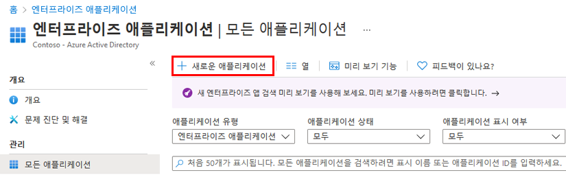
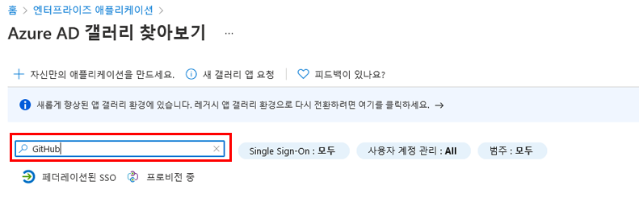
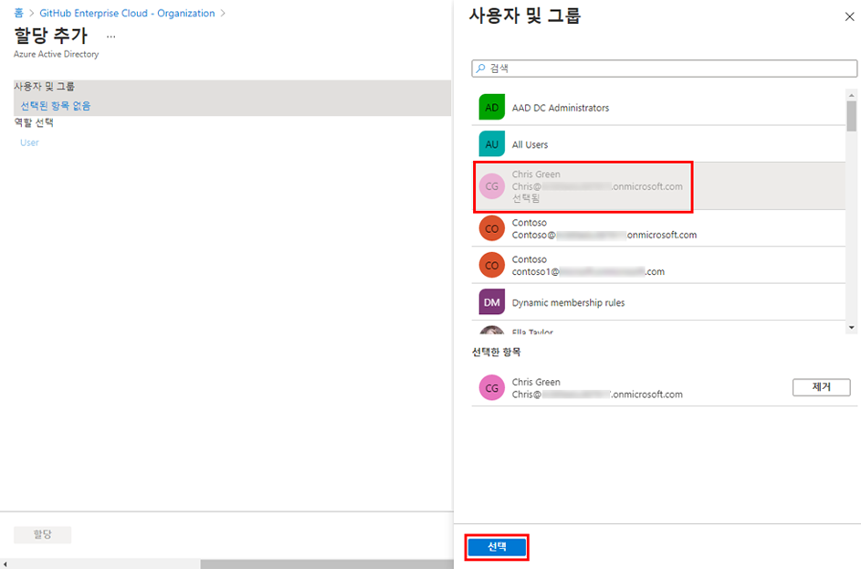

---
lab:
    title: '20 - 앱을 위한 액세스 관리 구현'
    learning path: '03'
    module: '모듈 01 - SSO를 위한 엔터프라이즈 앱 통합 계획 및 설계'
---

# 랩 20 - 앱을 위한 액세스 관리 구현

## 랩 시나리오

조직에서는 특정 사용자 또는 그룹만 엔터프라이즈 애플리케이션에 액세스할 수 있도록 할 것을 요구합니다. 사용자를 특정 애플리케이션에 할당해야 합니다.

#### 예상 시간: 5분

## Azure AD 테넌트에 앱 추가

1. 전역 관리자 계정을 사용하여 [https://portal.azure.com](https://portal.azure.com)에 로그인합니다.

1. 포털 메뉴를 열고 **Azure Active Directory**를 선택합니다.

1. Azure Active Directory 블레이드의 **관리**에서 **엔터프라이즈 애플리케이션**을 선택합니다.

1. 엔터프라이즈 애플리케이션 창에서 **+ 새 애플리케이션**을 선택합니다.

    

1. Azure AD 갤러리 찾아보기(미리 보기) 블레이드의 **애플리케이션 검색** 상자에 **GitHub**를 입력합니다.

    

1. 결과에서 **GitHub Enterprise Cloud – 엔터프라이즈 계정** 을 선택합니다.

1. **GitHub Enterprise Cloud – 엔터프라이즈 계정** 에서 설정을 검토한 다음 **생성**을 선택합니다.

1. 계정이 만들어지면 GitHub Enterprise Cloud – 엔터프라이즈 계정 블레이드로 리디렉션됩니다.

## 앱에 사용자 할당

1. GitHub Enterprise Cloud – 엔터프라이즈 계정 블레이드 개요 페이지로 이동하여, **시작하기** 항목에서 **1. 사용자 및 그룹 할당**을 선택합니다.

1. 또는 왼쪽 탐색의 **관리**에서 **사용자 및 그룹**을 선택할 수 있습니다.

1. 사용자 및 그룹 페이지의 메뉴에서 **+ 사용자/그룹 추가** 를 선택합니다.

1. 할당 추가 블레이드에서 **사용자 및 그룹**을 선택합니다.

1. 사용자 및 그룹 창에서 관리자 계정을 선택한 다음 **선택**을 선택합니다.

    

1. **할당**을 선택합니다.
