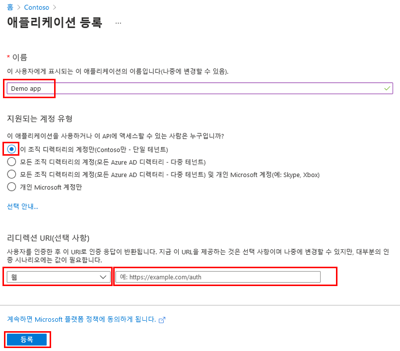
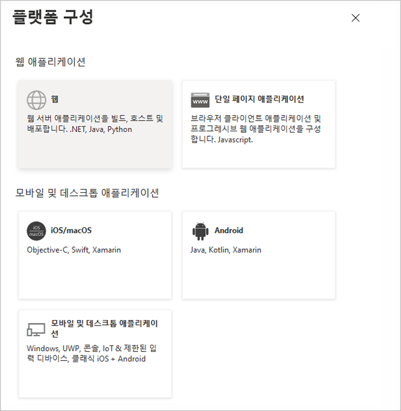
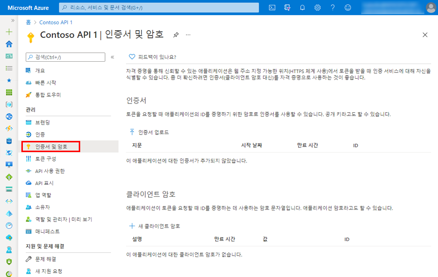
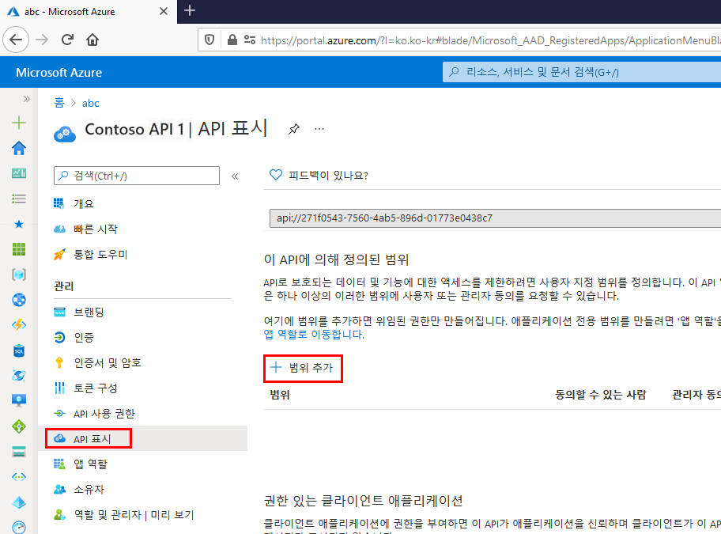
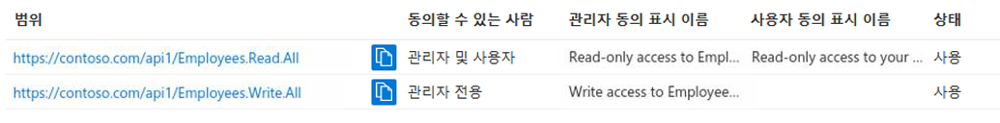

---
lab:
    title: '22 - 애플리케이션 등록'
    learning path: '03'
    module: '모듈 03 - 앱 등록 구현'
---

# 랩 22 - 애플리케이션 등록

#### 예상 시간: 20분

## 애플리케이션 등록

애플리케이션을 등록하면 앱과 Microsoft ID 플랫폼 간에 신뢰 관계가 설정됩니다. 신뢰는 단방향입니다. 즉, 앱이 Microsoft ID 플랫폼을 신뢰하지만 Microsoft ID 플랫폼이 앱을 신뢰하는 것은 아닙니다.

1. 전역 관리자 계정을 사용하여 [https://portal.azure.com](https://portal.azure.com)에 로그인합니다.

1. 포털 메뉴를 열고 **Azure Active Directory**를 선택합니다.

1. **Azure Active Directory** 블레이드의 **관리**에서 **앱 등록**을 선택합니다.

1. **앱 등록** 페이지의 메뉴에서 **+ 새 등록**을 선택합니다.

1. **애플리케이션 등록** 블레이드에서 기본값을 사용하여 **Demo app**이라는 앱을 등록합니다. 리디렉션 URI를 입력할 필요가 없습니다.

    

1. 완료되면 **Demo app** 블레이드로 이동됩니다.

## 리디렉션 URI 추가

리디렉션 URI는 Microsoft ID 플랫폼에서 사용자의 클라이언트를 리디렉션하고 인증 후에 보안 토큰을 보내는 위치입니다. 예를 들어 프로덕션 웹 애플리케이션에서 리디렉션 URI는 앱이 실행되는 퍼블릭 엔드포인트인 경우가 많습니다. 일반적으로 개발 중에 앱을 로컬로 실행하는 엔드포인트를 추가합니다.

1. 플랫폼 설정을 구성하여 등록된 애플리케이션에 대한 리디렉션 URI를 추가하고 수정합니다.

## 플랫폼 설정 구성

리디렉션 URI를 포함하여 각 애플리케이션 유형에 대한 설정은 Azure Portal의 **플랫폼 구성**에서 구성됩니다. **웹** 및 **단일 페이지 애플리케이션**과 같은 일부 플랫폼에서는 리디렉션 URI를 수동으로 지정해야 합니다. 모바일 및 데스크톱과 같은 다른 플랫폼의 경우 다른 설정을 구성할 때 생성한 리디렉션 URI 중에서 선택할 수 있습니다.

대상으로 하는 플랫폼 또는 디바이스에 따라 애플리케이션 설정을 구성하려면 다음을 수행합니다.

1. Azure Portal의 **앱 등록**에서 애플리케이션을 선택합니다.

1. **관리**에서 **인증**을 선택합니다.

1. **플랫폼 구성**에서 **플랫폼 추가**를 선택합니다.

1. **플랫폼 구성**에서 애플리케이션 유형(플랫폼)에 대한 타일을 선택하여 설정을 구성합니다.

    

    | 플랫폼| 구성 설정|
    | :--- | :--- |
    | 웹| Microsoft ID 플랫폼에서 사용자의 클라이언트를 리디렉션하고 인증 후에 보안 토큰을 보내는 위치인 앱에 대한 **리디렉션 URI**를 입력합니다. 서버에서 실행되는 표준 웹 애플리케이션의 경우 이 플랫폼을 선택합니다.|
    | 단일 페이지 애플리케이션| Microsoft ID 플랫폼에서 사용자의 클라이언트를 리디렉션하고 인증 후에 보안 토큰을 보내는 위치인 앱에 대한 **리디렉션 URI**를 입력합니다. JavaScript 또는 프레임워크(예: Angular, Vue.js, React.js 또는 Blazor WebAssembly)를 사용하여 클라이언트 쪽 웹앱을 빌드하는 경우 이 플랫폼을 선택합니다.|
    | iOS/macOS| *Info.plist* 또는 빌드 설정의 XCode에 있는 앱 **번들 ID**를 입력합니다. 번들 ID를 지정하면 리디렉션 URI가 생성됩니다.|
    | Android| AndroidManifest.xml 파일에서 찾을 수 있는 앱 **패키지 이름**을 입력하고, **서명 해시**를 생성하고 입력합니다. 이러한 설정을 지정하면 리디렉션 URI가 생성됩니다.|
    | 모바일 및 데스크톱 애플리케이션| **제안된 리디렉션 URI** 중 하나를 선택하거나 **사용자 지정 리디렉션 URI**를 지정합니다. 데스크톱 애플리케이션의 경우 [https://login.microsoftonline.com/common/oauth2/nativeclient](https://login.microsoftonline.com/common/oauth2/nativeclient)를 지정하는 것이 좋습니다. 최신 MSAL(Microsoft 인증 라이브러리)을 사용하지 않거나 broker를 사용하지 않는 모바일 애플리케이션의 경우 이 플랫폼을 선택합니다. 데스크톱 애플리케이션의 경우에도 이 플랫폼을 선택합니다.|

1. **구성**을 선택하여 플랫폼 구성을 완료합니다.

## 자격 증명 추가

자격 증명은 웹 API에 액세스하는 기밀 클라이언트 애플리케이션에서 사용됩니다. 기밀 클라이언트의 예로 웹앱, 다른 웹 API, 서비스 유형과 디먼 유형 애플리케이션이 있습니다. 자격 증명을 사용하면 애플리케이션에서 자체적으로 인증할 수 있으므로 런타임에 사용자의 상호 작용이 필요하지 않습니다.

인증서와 클라이언트 암호(문자열)를 모두 자격 증명으로 기밀 클라이언트 앱 등록에 추가할 수 있습니다.

## 인증서 추가

*공개 키*라고도 하는 인증서는 클라이언트 암호보다 높은 수준의 보안을 제공하므로 추천되는 자격 증명 유형입니다. 신뢰할 수 있는 공용 인증서를 사용하는 경우 인증서 및 암호 기능을 추가할 수 있습니다. 인증서는 다음 파일 형식 중 하나여야 합니다. .cer, .pem, .crt.

## 클라이언트 암호 추가

*애플리케이션 암호*라고도 하는 클라이언트 암호는 앱에서 ID 자체에 대한 인증서 대신 사용할 수 있는 문자열 값입니다. 이 암호가 두 가지 자격 증명 형식 중 사용하기 더 쉽습니다. 개발 중에 자주 사용되지만 인증서보다 안전하지 않은 것으로 간주됩니다. 인증서는 프로덕션 환경에서 실행되는 애플리케이션에서 사용해야 합니다.

1. Azure Portal의 **앱 등록**에서 애플리케이션을 선택합니다.

1. **인증서 및 비밀** > **새 클라이언트 비밀**을 차례로 선택합니다.

1. 클라이언트 비밀에 대한 설명을 추가합니다.

1. 기간을 선택합니다.

1. **추가**를 선택합니다.

1. 클라이언트 애플리케이션 코드에서 사용할 수 있도록 **비밀의 값을 적어 둡니다**. 이 페이지에서 나가면 *다시 표시되지 않습니다*.

## 웹 API 등록

웹 API에서 리소스에 대한 범위 지정 액세스를 제공하려면 먼저 Microsoft ID 플랫폼에 API를 등록해야 합니다.

1. 위의 단계를 수행합니다.

1. **리디렉션 URI 추가** 및 **플랫폼 설정 구성** 섹션을 건너뛰세요. 사용자가 대화형으로 로그인하지 않으므로 웹 API의 리디렉션 URI를 구성할 필요가 없습니다.

1. 지금은 **자격 증명 추가** 섹션을 건너뛰세요. API가 다운스트림 API에 액세스하는 경우에만 자체 자격 증명이 필요하며, 이 내용은 이 문서에서 다루지 않는 시나리오입니다.

웹 API가 등록되면 API의 코드에서 API 소비자에게 세부적인 사용 권한을 제공하는 데 사용할 수 있는 범위를 추가할 수 준비가 완료된 것입니다.

## 범위 추가

클라이언트 애플리케이션의 코드는 보호된 리소스(웹 API)에 대한 요청과 함께 액세스 토큰을 전달하여 웹 API에서 정의한 작업을 수행할 권한을 요청합니다. 그런 다음, 웹 API는 수신한 액세스 토큰에 작업에 필요한 범위(애플리케이션 권한이라고도 함)가 포함되어 있는 경우에만 요청된 작업을 수행합니다.

먼저 다음 단계를 수행하여 Employees.Read.All이라는 예제 범위를 생성합니다.

1. Azure Portal에 로그인합니다.

1. 여러 테넌트에 액세스할 수 있는 경우 위쪽 메뉴의 **디렉터리 + 구독** 필터를 사용하여 클라이언트 앱의 등록이 포함된 테넌트를 선택합니다.

1. **Azure Active Directory** > **앱 등록**을 차례로 선택한 다음, API의 앱 등록을 선택합니다.

1. **API 표시** > **범위 추가**를 선택합니다.

    

1. 아직 **애플리케이션 ID URI**를 구성하지 않은 경우 설정하라는 메시지가 표시됩니다. 앱 ID URI는 API 코드에서 참조할 범위의 접두사 역할을 하며 전역적으로 고유해야 합니다. api://\<application-client-id\> 형식으로 제공되는 기본값을 사용해도 되고, `https://contoso.com/api`처럼 좀 더 읽기 쉬운 URI를 지정해도 됩니다.

1. 다음으로 **범위 추가 창**에서 범위 특성을 지정합니다. 이 연습에서는 예제 값을 사용해도 되고, 직접 값을 지정해도 됩니다.

    | 필드| 설명| 예|
    | :--- | :--- | :--- |
    | 범위 이름| 범위의 이름입니다. 일반적인 범위 명명 규칙은 resource.operation.constraint입니다.| Employees.Read.All|
    | 동의할 수 있는 사람| 이 범위를 사용자가 동의할 수 있는지 아니면 관리자 동의가 필요한지 여부를 지정합니다. 높은 권한을 적용하려면 관리자만을 선택합니다.| 관리자 및 사용자|
    | 관리자 동의 표시 이름| 범위의 목적에 대한 간단한 설명으로 관리자에게만 표시됩니다.| 직원 레코드에 대한 읽기 전용 액세스|
    | 관리자 동의 설명| 범위에서 부여하는 권한에 대한 자세한 설명으로 관리자에게만 표시됩니다.| 애플리케이션이 모든 직원 데이터에 대해 읽기 전용 액세스 권한을 갖도록 허용합니다.|
    | 사용자 동의 표시 이름| 범위의 목적에 대한 간단한 설명입니다. 동의할 수 있는 사람을 관리자 및 사용자로 설정한 경우에만 사용자에게 표시됩니다.| 직원 레코드에 대한 읽기 전용 액세스|
    | 사용자 동의 설명| 범위에서 부여하는 권한에 대한 자세한 설명입니다. 동의할 수 있는 사람을 관리자 및 사용자로 설정한 경우에만 사용자에게 표시됩니다.| 애플리케이션이 직원 데이터에 대해 읽기 전용 액세스 권한을 갖도록 허용합니다.|

1. **상태**를 **사용**으로 설정한 다음, **범위 추가**를 선택합니다.

1. (선택 사항) 관리자가 정의한 범위에 동의하도록 요청하는 메시지를 앱 사용자에게 표시하지 않으려면 웹 API에 액세스하도록 클라이언트 애플리케이션에 *미리 권한을 부여*하면 됩니다. 사용자에게는 동의를 거부할 기회가 없기 때문에 신뢰할 수 있는 클라이언트 애플리케이션에*만* 미리 권한을 부여해야 합니다.

   1. **권한 있는 클라이언트 애플리케이션**에서 **클라이언트 애플리케이션 추가**를 선택합니다.

   1. 미리 권한을 부여하려는 클라이언트 애플리케이션의 **애플리케이션(클라이언트) ID** 를 입력합니다. 예를 들어 앞에서 등록한 웹 애플리케이션의 ID를 입력합니다.

   1. **권한 있는 모든 범위**에서 동의 메시지를 표시하지 않을 범위를 선택한 다음, **애플리케이션 추가**를 선택합니다.

   1. 이 선택 사항을 수행한 경우 클라이언트 앱은 이제 PCA(미리 권한이 부여된 클라이언트 앱)이며, 사용자가 클라이언트 앱에 로그인할 때 동의 여부를 묻는 메시지가 표시되지 않습니다.

## 관리자 동의가 필요한 범위 추가

다음으로 관리자만 동의할 수 있는 다른 예제 범위 Employees.Write.All을 추가합니다. 관리자 동의가 필요한 범위는 일반적으로 더 높은 권한이 있는 작업에 대한 액세스를 제공하는 데 사용되며, 사용자가 대화형으로 로그인하지 않는 백 엔드 서비스 또는 디먼으로 실행되는 클라이언트 애플리케이션을 통해 제공되는 경우가 많습니다.

1. Employees.Write.All 예제 범위를 추가하려면 위 단계를 수행하고 **범위 추가** 창에서 다음 값을 지정합니다.

    | 필드| 예제 값|
    | :--- | :--- |
    | 범위 이름| Employees.Write.All|
    | 동의할 수 있는 사람| 관리자만|
    | 관리자 동의 표시 이름| 직원 레코드에 대한 쓰기 권한|
    | 관리자 동의 설명| 애플리케이션이 모든 직원 데이터에 대해 쓰기 액세스 권한을 갖도록 허용합니다.|
    | 사용자 동의 표시 이름| 없음(비워 둠)|
    | 사용자 동의 설명| 없음(비워 둠)|

## 공개된 범위 확인

이전 섹션에서 설명한 두 가지 예제 범위를 모두 성공적으로 추가했다면 다음 이미지처럼 웹 API 앱 등록의 **API 표시** 창에 두 범위가 표시됩니다.

이미지에 표시된 것처럼 범위의 전체 문자열은 웹 API의 **애플리케이션 ID URI**와 범위의 **범위 이름**을 연결한 것입니다.

예를 들어, 웹 API의 애플리케이션 ID URI가 `https://contoso.com/api`이고 범위 이름이 Employees.Read.All이면 전체 범위는 다음과 같습니다.

`https://contoso.com/api/Employees.Read.All`

## 공개된 범위 사용

다음으로, 위 단계를 수행하여 정의한 웹 API에 대한 액세스 권한과 정의한 범위를 사용하여 클라이언트 앱의 등록을 구성합니다.

클라이언트 앱 등록에 웹 API에 대한 액세스 권한이 부여되면 클라이언트에서 Microsoft ID 플랫폼을 통해 OAuth 2.0 액세스 토큰을 발급할 수 있습니다. 클라이언트는 웹 API를 호출할 때, 클라이언트의 앱 등록에 지정된 권한으로 범위(scp) 클레임이 설정된 액세스 토큰을 제공합니다.

추가 범위를 나중에 필요한 대로 노출할 수 있습니다. 웹 API는 여러 작업에 연결된 여러 범위를 공개할 수 있습니다. 리소스는 수신하는 OAuth 2.0 액세스 토큰의 범위(scp) 클레임을 평가하여 런타임에 웹 API에 대한 액세스를 제어할 수 있습니다.
