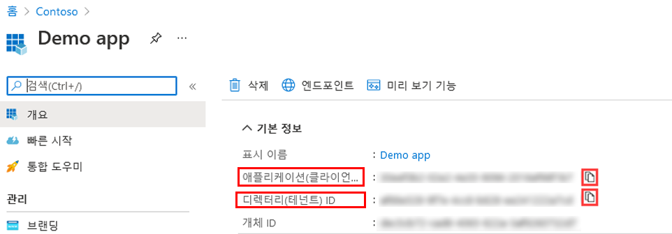
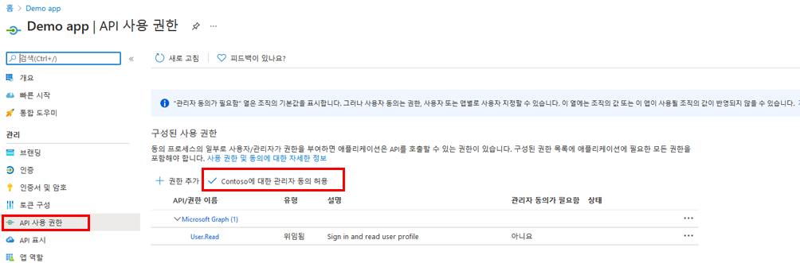
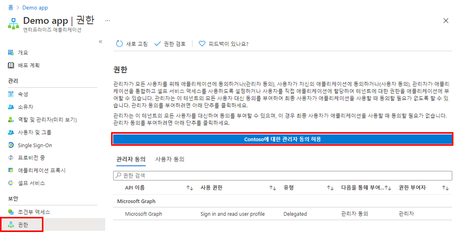

---
lab:
    title: '23 - 애플리케이션에 대한 테넌트 전체 관리자 동의 부여'
    learning path: '03'
    module: '모듈 03 - 앱 등록 구현'
---

# 랩 23: 애플리케이션에 대한 테넌트 전체 관리자 동의 부여

## 랩 시나리오

조직에서 개발한 애플리케이션 또는 Azure AD 테넌트에 직접 등록된 애플리케이션의 경우 Azure Portal에서 앱 등록의 테넌트 전체 관리자 동의를 부여할 수 있습니다.

#### 예상 시간: 10분

## 앱 등록에서 관리자 동의 부여

> **경고**
> 애플리케이션에 테넌트 전체 관리자 동의를 부여하면 앱과 앱 게시자에게 조직의 데이터에 대한 액세스 권한이 부여됩니다. 동의를 부여하기 전에 애플리케이션에서 요청하는 권한을 신중하게 검토합니다.

전역 관리자 역할은 Microsoft Graph API에 대한 애플리케이션 권한에 대한 관리자 동의를 제공하기 위해 필요합니다.

1. 이전 연습에서는 Demo app이라는 앱을 만들었습니다. 필요한 경우 Microsoft Azure에서 **Azure Active Directory > 앱 등록 > Demo app**으로 이동합니다.

1. **Demo app** 블레이드에서 나중에 사용할 수 있도록 각 **애플리케이션(클라이언트) ID** 및 **디렉터리(테넌트) ID** 값을 찾아서 복사, 저장합니다.

    

1. 왼쪽 탐색 영역의 **관리**에서 **API 권한**을 선택합니다.

1. **구성된 사용 권한**에서 **관리자 동의 허용**을 선택합니다.

    

1. 대화 상자를 검토한 다음 **예**를 선택합니다.

    > **경고**
    > 앱 등록을 통해 테넌트 전체 관리자 동의를 부여하면 이전에 테넌트 전체에 부여된 모든 권한이 해지됩니다. 사용자가 이전에 대신 부여 받은 사용 권한은 영향을 받지 않습니다.

## 엔터프라이즈 앱에서 관리자 동의 허용

애플리케이션이 테넌트에 이미 프로비저닝된 경우 엔터프라이즈 애플리케이션을 통해 테넌트 전체 관리자 동의를 부여할 수 있습니다.

1. Microsoft Azure에서 **Azure Active Directory > 엔터프라이즈 애플리케이션 > Demo app**으로 이동합니다.

1. **Demo app** 블레이드의 왼쪽 탐색 영역에 있는 **보안** 아래에서 **사용 권한**을 선택합니다.

1. **사용 권한**에서 **관리자 동의 허용**을 선택합니다.

    

    > [!경고]
    > 경고
    > 앱 등록을 통해 테넌트 전체 관리자 동의를 부여하면 이전에 테넌트 전체에 부여된 모든 권한이 해지됩니다. 사용자가 이전에 대신 부여 받은 사용 권한은 영향을 받지 않습니다.

1. 메시지가 표시되면 전역 관리자 계정을 사용하여 로그인합니다.

1. **사용 권한 요청됨** 대화 상자에서 정보를 검토한 다음 **동의**를 선택합니다.
