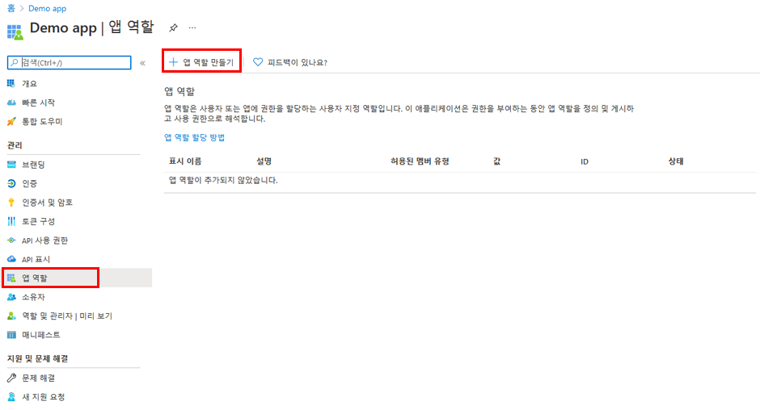

---
lab:
    title: '24 - 앱에 앱 역할 추가 및 토큰으로 수신'
    learning path: '03'
    module: '모듈 03 - 앱 등록 구현'
---

# 랩 24: 앱에 앱 역할 추가 및 토큰으로 수신

## 랩 시나리오

RBAC(역할 기반 액세스 제어)는 애플리케이션에서 권한 부여를 적용하는 데 널리 사용되는 메커니즘입니다. RBAC를 사용하는 경우, 관리자는 개별 사용자나 그룹이 아닌 역할에 사용 권한을 부여합니다. 그런 다음 관리자는 다른 사용자 및 그룹에 역할을 할당하여 누가 어떤 컨텐츠와 기능에 액세스 권한을 갖는지를 제어할 수 있습니다. RBAC 역할을 구현할 계획이며 이 절차를 수행하는 방법을 이해하고 있는지 확인해야 합니다.

#### 예상 시간: 10분

## 앱 역할 UI를 사용하여 앱 역할 선언

>[!중요]
>앱 역할 포털 UI 기능은 퍼블릭 미리 보기로 제공됩니다. 퍼블릭 미리 보기는 서비스 수준 계약 없이 제공되며 프로덕션 워크로드에는 사용하지 않는 것이 좋습니다. 특정 기능이 지원되지 않거나 기능이 제한될 수 있습니다.

Azure Portal의 사용자 인터페이스를 사용하여 앱 역할을 만들려면 다음을 수행합니다.

1. 전역 관리자 계정을 사용하여 [https://portal.azure.com](https://portal.azure.com)에 로그인합니다.

1. 포털 메뉴를 열고 **Azure Active Directory**를 선택합니다.

1. **Azure Active Directory** 블레이드의 **관리**에서 **앱 등록**을 선택합니다.

1. **앱 역할**을 선택합니다.**| 미리 보기** 를 선택하고 **앱 역할 생성**을 선택합니다.

    

1. **앱 역할 생성** 창의 **표시 이름** 상자에 **설문 조사 작성자**를 입력합니다.

1. **구성원 유형 허용**에서 **사용자/그룹** 을 선택합니다.

1. **값** 상자에 **Survey.Create**를 입력합니다.

1. **설명** 상자에 **작성자가 설문 조사를 만들 수 있음**이라고 입력합니다.

1. 설명은 필수 필드입니다.

1. **이 앱 역할을 사용하도록 설정하시겠습니까?** 가 선택되어 있는지 확인한 다음 **적용**을 선택합니다.

## 역할에 사용자 및 그룹 할당

애플리케이션에서 앱 역할을 추가하고 나면 이 역할에 사용자 및 그룹을 할당할 수 있습니다. 역할에 사용자 및 그룹을 할당하는 작업은 포털의 UI를 통해 수행하거나 [https://docs.microsoft.com/graph/api/user-post-approleassignments](https://docs.microsoft.com/graph/api/user-post-approleassignments)를 사용하여 프로그래밍 방식으로 수행할 수 있습니다. 다양한 앱 역할에 할당된 사용자가 애플리케이션에 로그인하면 해당 토큰은 역할 클레임에 할당된 역할을 갖게 됩니다.

Azure Portal을 사용하여 사용자 및 그룹을 역할에 할당하려면 다음을 수행합니다.

1. [https:portal.azure.com](https:portal.azure.com)에 로그인합니다.

1. IAzure Active Directory 왼쪽에 있는 탐색 메뉴에서 **엔터프라이즈 애플리케이션**을 선택합니다.

1. **모든 애플리케이션** 목록에서 **Demo app**을 선택합니다.

1. 이 앱은 이전 연습에서 만들었습니다.

1. **관리**에서 **사용자 및 그룹**을 선택합니다.

1. 메뉴에서 **+ 사용자/그룹 추가** 를 선택합니다.

1. **할당 추가** 블레이드에서 **사용자 및 그룹**을 선택합니다.

1. 사용자와 보안 그룹 목록이 표시됩니다. 특정 사용자 또는 그룹을 검색하고 목록에 표시되는 여러 사용자 및 그룹을 선택할 수 있습니다.

1. 사용자와 그룹을 선택한 후 **선택**을 선택합니다.

1. **역할 선택**을 사용하는 경우 애플리케이션에 대해 정의한 모든 역할이 표시됩니다.

1. 역할을 선택한 다음 **선택**을 선택합니다.

1. **할당**을 선택하여 앱에 사용자와 그룹 할당을 마칩니다.

1. 추가한 사용자와 그룹이 **사용자 및 그룹** 목록에 보이는지 확인합니다.
