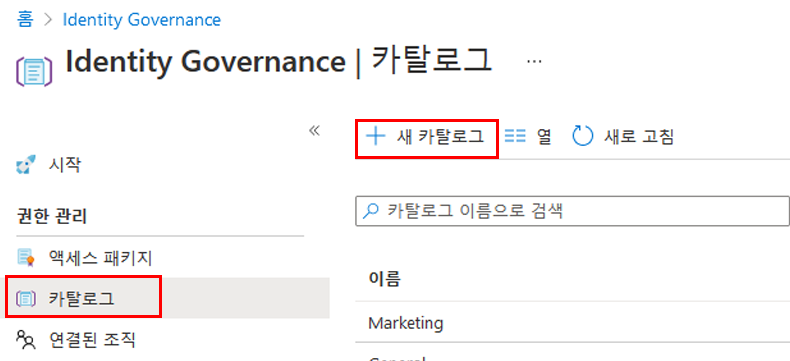
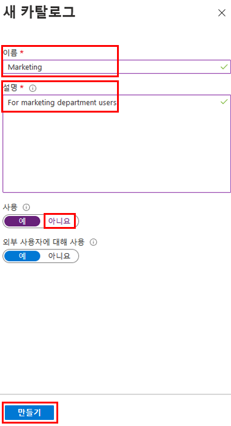
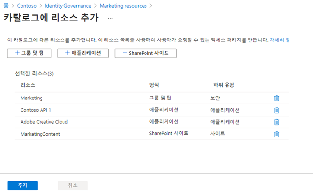
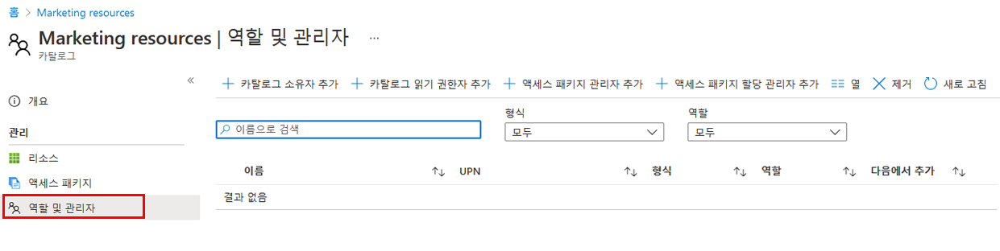
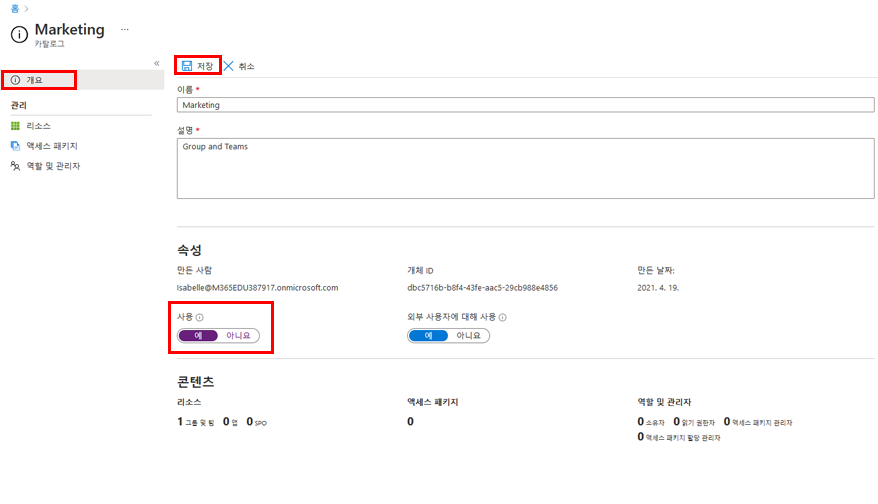

---
lab:
    title: '25 - Azure AD 권한 관리에서 리소스 카탈로그 생성 및 관리'
    learning path: '04'
    module: '모듈 01 - 권한 관리 계획 및 구현'
---

# 랩 25: Azure AD 권한 관리에서 리소스 카탈로그 생성 및 관리

## 랩 시나리오

카탈로그는 리소스 및 액세스 패키지의 컨테이너입니다. 관련 리소스 및 액세스 패키지를 그룹화하려는 경우 카탈로그를 생성합니다. 카탈로그를 만드는 사람은 첫 번째 카탈로그 소유자가 됩니다. 카탈로그 소유자는 카탈로그 소유자를 추가할 수 있습니다. 조직에서 카탈로그를 만들고 구성해야 합니다.

#### 예상 소요 시간: 15분

## 카탈로그 만들기

1. 전역 관리자 계정을 사용하여 [https://portal.azure.com](https://portal.azure.com)에 로그인합니다.

    >중요
    >Azure AD 사용 약관을 사용하고 구성하려면 다음이 필요합니다.
    >
    >- Azure AD Premium P1, P2, EMS E3 또는 EMS E5 구독.
    >- 해당 구독이 없는 경우 Azure AD Premium을 구매하거나 Azure AD Premium 평가판을 사용할 수 있습니다.
    >- 구성하려는 디렉터리에 대한 다음 관리자 계정 중 하나:
    >    - 전역 관리자
    >    - 보안 관리자
    >    - 조건부 액세스 관리자

2. **Azure Active Directory**를 열고 **ID 거버넌스**를 선택합니다.

3. 왼쪽 메뉴의 **권한 관리**에서 **카탈로그**를 선택합니다.

4. 상단 메뉴에서 **+새 카탈로그**를 선택합니다.

    

5. 새 카탈로그 창의 **이름** 상자에 **마케팅**을 입력합니다.

6. **설명** 상자에 **마케팅 부서 사용자용**을 입력합니다. 사용자는 액세스 패키지의 세부 정보에서 해당 정보를 볼 수 있습니다.

7. **외부 사용자 사용 활성화**는 선택한 외부 디렉터리 사용자가 카탈로그에 있는 액세스 패키지를 요청할 수 있도록 허용합니다. 이 설정은 변경되지 않습니다.

8. **활성화에서 아니요**를 선택합니다.

9. 카탈로그를 즉시 사용할 수 있도록 활성화할 수 있으며 사용할 때까지 스테이징하거나 사용하지 않음 상태로 유지하려면 비활성화할 수 있습니다. 해당 연습에서는 카탈로그를 활성화할 필요가 없습니다.

    

10. 만들기를 선택합니다.

## 카탈로그에 리소스를 추가합니다.

액세스 패키지에 리소스를 포함하려면 리소스가 카탈로그에 있어야 합니다. 추가할 수 있는 리소스 유형은 그룹, 애플리케이션, SharePoint Online 사이트입니다. 그룹은 클라우드 생성 Microsoft 365 그룹 또는 클라우드 생성 Azure AD 보안 그룹일 수 있습니다. 애플리케이션은 SaaS 애플리케이션 및 Azure AD에 페더레이션된 애플리케이션을 포함한 Azure AD 엔터프라이즈 애플리케이션일 수 있습니다. 사이트는 SharePoint Online 사이트 또는 SharePoint Online 사이트 모음일 수 있습니다.

1. 필요한 경우, ID 거버넌스 블레이드에서 **카탈로그**를 선택합니다.

2. **카탈로그** 목록에서 **마케팅**을 선택합니다.

3. 왼쪽 탐색 영역 내 **관리**에서 **리소스**를 선택합니다.

4. 메뉴에서 + **리소스 추가**를 선택합니다.

5. 카탈로그 블레이드에 리소스 추가에서 사용 가능한 옵션을 검토합니다.  다음 항목을 추가합니다.

| 리소스 유형 | 값 |
| :------------- | :---------- |
|  **그룹 및 팀** | 소매 |
|  **애플리케이션** | Box |
|  **애플리케이션** | Salesforce |
|  **SharePoint 사이트** | 브랜드 SharePoint <<<사용 가능한 SharePoint 사이트 목록에서 선택 |

6. 그룹 및 팀, 애플리케이션 또는 SharePoint 사이트에 리소스가 없을 수 있습니다. 리소스 카테고리를 선택하고 해당 카테고리에서 리소스를 선택합니다.

7. 이 연습에서는 사용 가능한 모든 리소스를 선택할 수 있습니다.

    

8. 완료되면 **추가**를 클릭합니다. 해당 리소스는 이제 카탈로그 내에서 액세스 패키지에 포함될 수 있습니다.

## 카탈로그 소유자 추가

카탈로그를 생성한 사용자가 첫 번째 카탈로그 소유자가 됩니다. 카탈로그 관리를 위임하려면 사용자를 카탈로그 소유자 역할에 추가합니다. 이렇게 하면 카탈로그 관리 책임을 공유하는 데 도움이 됩니다.

1. 필요한 경우 Azure Portal에서 **Azure Active Directory** > **ID 거버넌스 > 카탈로그** 로 이동한 후 **마케팅**을 선택합니다.

2. 마케팅 카탈로그 블레이드의 왼쪽 탐색 메뉴에서 역할 및 관리자를 선택합니다.

    

3. 상단 메뉴에서 사용 가능한 역할을 검토하고 **+ 카탈로그 소유자 추가** 를 선택합니다.

4. 구성원 선택 창에서 **Adele Vance**를 선택한 다음 **선택**을 선택합니다.

5. 역할 및 관리자 목록에서 새로 추가된 역할을 검토합니다.

## 카탈로그 편집

카탈로그의 이름 및 설명을 편집할 수 있습니다. 사용자는 액세스 패키지의 세부 정보에서 해당 정보를 볼 수 있습니다.

1. 마케팅 블레이드의 왼쪽 탐색 영역에서 **개요**를 선택합니다.

2. 상단 메뉴에서 **편집**을 선택합니다.

3. 설정을 검토하고 **속성** > **사용**에서 **예**를 선택합니다.

    

4. **저장**을 선택합니다.

## 카탈로그 삭제

액세스 패키지가 없는 경우에만 카탈로그를 삭제할 수 있습니다.

1. 마케팅 카탈로그의 개요 페이지에 있는 상단 메뉴에서 삭제를 선택합니다.

2. 삭제 대화 상자에서 정보를 검토한 다음 **아니요**를 선택합니다.

    **참고** - 카탈로그는 다음 랩에서 사용할 것이므로 그대로 둡니다.
