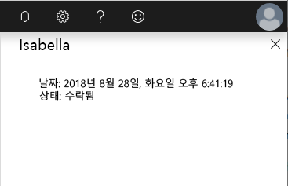
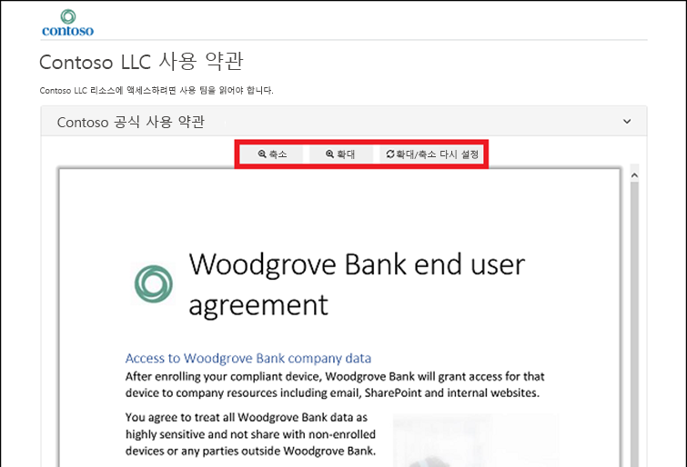

---
lab:
    title: '26 - 사용 약관 및 동의 보고 추가'
    learning path: '04'
    module: '모듈 01 - 권한 관리 계획 및 구현'
---

# 랩 26: 사용 약관 및 동의 보고 추가 

## 랩 시나리오

Azure AD 사용 약관 정책은 조직이 최종 사용자에게 정보를 제공하는 데 사용할 수 있는 간단한 방법을 제공합니다. 이 프레젠테이션은 사용자가 법률 또는 규정 준수 요구 사항에 대한 관련 고지 사항을 볼 수 있게 해줍니다. 이 문서는 사용 약관(ToU) 정책을 시작하는 방법을 설명합니다.

조직의 ToU 정책을 만들고 적용해야 합니다.

#### 예상 소요 시간: 20분

## 연습 1 - 사용 약관 설정 및 테스트

### 작업 1 - 사용 약관 추가

사용 약관 문서를 완성했으면 다음 절차에 따라 추가합니다.

1. 전역 관리자 계정을 사용하여 [https://portal.azure.com](https://portal.azure.com) 에 로그인합니다.

1. **Azure Active Directory**를 열고 **ID 거버넌스**를 선택합니다.

1. 왼쪽 탐색 메뉴의 **사용 약관**에서 **사용 약관**을 선택합니다.

1. 사용 약관 페이지의 상단 메뉴에서 **+ 새 약관**을 선택합니다.

    

1. **이름** 상자에 **테스트 사용 약관**을 입력합니다.

1. Azure Portal에서 사용되는 사용 약관입니다.

1. **표시 이름** 상자에 **Contoso 사용 약관**을 입력합니다.

1. 사용자가 로그인하면 표시되는 제목입니다.

1. **사용 약관 문서** 상자를 선택하고 완성된 사용 약관 PDF로 이동하여 선택합니다.

   **ToU 파일 제공** - github 리포지토리 AllFiles/Labs/Lab26으로 이동하여 이 랩에서 사용할 샘플 Terms-of-User PDF 문서를 다운로드합니다.

1. 사용 약관 문서의 언어로 **한국어**를 선택합니다.

   **참고** - 언어 옵션을 사용하면 사용 약관을 다양한 언어로 여러 개 업로드할 수 있습니다. 최종 사용자에게 표시되는 사용 약관의 버전은 브라우저 기본 설정에 기반합니다.

1. 최종 사용자에게 동의하기 전 사용 약관을 보도록 요구하려면 **사용자가 사용 약관을 확장하도록 함**을 **켜기**로 설정합니다.

1. 최종 사용자에게 액세스하는 모든 디바이스에서 사용 약관에 동의하도록 요구하려면 **사용자가 모든 디바이스에서 동의하도록 함**을 **켜기**로 설정합니다. 해당 옵션을 사용하도록 설정하면 사용자가 추가 애플리케이션을 설치해야 할 수 있습니다.

    >[!경고]  
    >모든 디바이스에서 동의하려면 사용자가 액세스하기 전에 각 디바이스를 Azure AD에 등록해야 합니다.

1. 일정에서 사용 약관 동의를 만료하려면 **만료 동의**를 **켜기**로 설정합니다. 켜기로 설정되면 두 개의 추가 일정 설정이 표시됩니다.

    

1. **만료 시작 날짜** 및 **빈도** 설정을 사용하여 사용 약관 만료의 일정을 지정합니다. 다음 표는 몇 가지 예제 설정의 결과를 보여 줍니다.

    | 만료 시작 날짜 | 빈도 | 결과 |
    |---|---|---|
    | 오늘 날짜 | 매달 | 오늘부터 사용자는 사용 약관에 동의한 후 매월 다시 동의해야 합니다.|
    | 미래 날짜 | 매달 | 오늘부터 사용자는 사용 약관에 동의해야 합니다. 미래 날짜가 발생하면 동의가 만료되고 이후 사용자는 매월 다시 동의해야 합니다. |

    예를 들어 만료 시작 날짜를 **1월 1일**로 설정하고 빈도를 **매월**로 설정하는 경우 사용자 두 명에 대한 만료는 다음과 같은 방식으로 발생합니다.

    | 사용자 | 첫 번째 동의 날짜 | 첫 번째 만료 날짜 | 두 번째 만료 날짜 | 세 번째 만료 날짜 |
    |---|---|---|---|---|
    | Alice | 1/1 | 1/2 | 1/5 | 1/4|
    | Bob | 15/1 | 1/2 | 1/5| 1/4 |

1. **다시 동의가 필요하기 전 기간(일)** 설정을 사용하여 사용자가 사용 약관에 다시 동의해야 하기 전까지의 일 수를 지정합니다. 이를 통해 사용자는 자신의 일정을 따를 수 있습니다. 예를 들어 기간을 **30**일로 설정하면 두 사용자에 대한 만료가 다음과 같은 방식으로 발생합니다.

    | 사용자 | 첫 번째 동의 날짜 | 첫 번째 만료 날짜 | 두 번째 만료 날짜 | 세 번째 만료 날짜 |
    |---|---|---|---|---|
    | Alice | 1/1 | 31/1 | 2/5 | 1/4|
    | Bob | 15/1 | 14/2 | 16/5| 15/4

    >[!참고]  
    동의 만료 및 다시 동의가 필요하기 전 기간(일) 설정을 함께 사용할 수 있지만, 일반적으로 두 설정 중 하나만 사용합니다.

1. **조건부 액세스**에서 **사용자 지정 정책**을 선택합니다.

    | 템플릿 | 설명 |
    |---|---|
    | **모든 게스트에 대한 클라우드 앱 액세스** | 모든 게스트 및 모든 클라우드 앱에 대한 조건부 액세스 정책이 생성됩니다. 이 정책은 Azure Portal에 영향을 줍니다. 이 항목이 생성되면 로그아웃했다 로그인해야 할 수 있습니다. | 
    |**모든 사용자에 대한 클라우드 앱 액세스** | 모든 사용자 및 모든 클라우드 앱에 대한 조건부 액세스 정책이 생성됩니다. 이 정책은 Azure Portal에 영향을 줍니다. 이 항목이 생성되면 로그아웃했다 로그인해야 할 수 있습니다. |
    | **사용자 지정 정책** | 이 사용 약관이 적용될 사용자, 그룹 및 앱을 선택합니다. |
    | **나중에 조건부 액세스 정책 생성** | 이 사용 약관은 조건부 액세스 정책을 만들 때 권한 부여 컨트롤 목록에 표시됩니다. |

    >[!중요]  
    >조건부 액세스 정책 제어(사용 약관 포함)는 서비스 계정에 적용을 지원하지 않습니다. 조건부 액세스 정책에서 모든 서비스 계정을 제외하는 것을 추천합니다.

    사용자 지정 조건부 액세스 정책을 통해 특정 클라우드 애플리케이션 또는 사용자 그룹에까지 세분화된 사용 약관을 설정할 수 있습니다. 자세한 내용은 [https://docs.microsoft.com/ko-kr/azure/active-directory/conditional-access/require-tou](https://docs.microsoft.com/ko-kr/azure/active-directory/conditional-access/require-tou)를 참조하세요.

1. 완료되면 **생성**을 선택합니다.

    

1. 사용 약관을 만들면 자동으로 조건부 액세스 정책 페이지로 리디렉션됩니다. 페이지의 **이름** 상자에 **사용 약관 적용**을 입력합니다.

1. **할당**에서 **사용자 및 그룹**을 선택합니다.

1. 포함 탭에서 **사용자 및 그룹** 확인란을 선택합니다.

1. 선택 창에서 사용 약관 정책을 테스트하는 데 사용할 사용자로 **Adele Vance**를 선택합니다.

   **경고** - 모든 조건부 액세스 정책과 같은 관리자 계정을 선택하는 경우 조건부 액세스 정책을 변경할 수 있는 충분한 권한이 있는 다른 계정이 있는지를 고려해야 합니다. 이는 조건부 액세스 정책으로 인해 원치 않는 결과가 발생하는 경우 관리자 계정이 잠기지 않도록 하기 위한 것입니다.

1. **클라우드 앱 또는 작업**을 선택합니다.

1. **모든 클라우드 앱**을 선택합니다.

1. **액세스 제어** 아래에서 **허용**을 선택합니다.

1. 권한 부여 창에서 **테스트 사용 약관**을 선택한 다음 **선택**을 선택합니다.

1. **정책 사용**에서 **켜기**를 선택합니다.

1. 완료되면 **생성**을 선택합니다.

    

1. 사용자 고유의 계정을 사용하는 경우 브라우저를 새로 고칠 수 있습니다. 다시 로그인하라는 메시지가 표시됩니다. 로그인할 때 사용 약관에 동의해야 합니다.

### 작업 2 - Adele로 로그인

1. 새 InPrivate 브라우저 창을 엽니다.
2. https://portal.azure.com에 연결합니다.
3. 이미 로그인되어 있다는 메시지가 표시되면 화면 오른쪽 위에서 로그인되어 있는 사용자 이름을 클릭하고 **다른 계정으로 로그인**을 선택합니다.
4. 다음 설정을 사용하여 Adele로 로그인합니다.

    | 설정 | 입력할 값 |
    | :--- | :--- |
    | 사용자 이름 | **AdeleV@** `<<your domain name>>.onmicrosoft.com` |
    | 암호 | **Pass@w.rd1234**(이전 랩에서 암호 선택 옵션을 사용했다고 가정함) |

5. MFA 요청을 진행하여 Adele의 로그인 유효성을 검사합니다.
6. 사용 약관을 확인합니다.
7. **동의** 또는 **동의 안 함**을 선택할 수 있습니다.

    **참고** - **동의 안 함**을 선택하면 다음 번에 AdeleV로 로그인할 때 사용 약관을 확인하고 해당 내용에 동의하라는 메시지가 다시 표시됩니다.
    

### 작업 3 - 사용 약관에 동의한 사용자와 동의하지 않은 사용자 관련 보고서 확인

[사용 약관] 블레이드에는 사용 약관에 동의한 사용자 및 거부한 사용자 수가 표시됩니다. 해당 사용자 수 및 동의/거부한 사용자 명단은 사용 약관의 유효 기간 동안 저장됩니다.

1. Microsoft Azure의 **ID 거버넌스 > 사용 약관**에서 사용 약관을 찾습니다.

1. 사용 약관에 대해 **동의** 또는 **거부** 아래에 있는 숫자를 선택하여 사용자의 현재 상태를 확인합니다.

    

1. 이 연습에서는 사용 약관에 대한 동의나 거부가 없을 수 있습니다. 다음 예제에서는 **동의** 값이 선택되었습니다. 사용 약관에 동의한 사용자에 대한 보고된 사용자 정보를 볼 수 있습니다.

    

1. 개별 사용자에 대한 기록을 보려면 사용자 이름 오른쪽에 있는 줄임표를 선택한 다음 **기록 보기**를 선택합니다.

    

1. [기록 보기] 창에서 모든 승인, 거부 및 만료 기록을 확인합니다.

    

## 사용자에게 표시되는 사용 약관

1. 사용 약관을 만들고 적용한 후에는 범위 내에 있는 사용자에게 사용 약관 페이지가 표시됩니다.

    

1. 사용자는 사용 약관을 확인하고 필요한 경우 단추를 사용하여 확대 및 축소할 수 있습니다.

    

1. 모바일 디바이스에서 사용 약관은 다음 예시와 유사하게 표시됩니다.

    

### 사용자가 사용 약관을 검토하는 방법

사용자는 다음 절차를 수행하여 자신이 동의한 사용 약관을 검토하고 살펴볼 수 있습니다.

1. [https://myapps.microsoft.com](https://myapps.microsoft.com/)으로 이동하여 사용자 계정으로 로그인합니다.

1. 개요 페이지에서 설정 및 개인 정보 보기를 선택합니다.

    

1. 설정 및 개인 정보 페이지에서 **개인 정보** 탭을 선택합니다.

    

1. **조직의 공지**에서 동의한 사용 약관을 검토할 수 있습니다.

## 사용 약관 세부 정보 편집

사용 약관 세부 정보 중 일부는 편집할 수 있지만, 기존 문서는 수정할 수 없습니다. 다음 절차에서는 세부 정보를 편집하는 방법에 대해 설명합니다.

1. 전역 관리자로 [https://portal.azure.com](https://portal.azure.com)에 로그인합니다.

1. Azure Active Directory를 열고 **ID 거버넌스**를 선택합니다.

1. 왼쪽 탐색 메뉴의 **사용 약관**에서 **사용 약관**을 선택합니다.

1. 편집하려는 사용 약관을 선택합니다.

1. 상단 메뉴에서 **약관 편집**을 선택합니다.

1. 사용 약관 편집 창에서 다음을 변경할 수 있습니다.

    - **이름** – 최종 사용자와 공유되지 않는 사용 약관의 내부 이름입니다.
  
    - **표시 이름** – 최종 사용자가 볼 수 있는 사용 약관의 이름입니다.

    - **사용자가 사용 약관을 확장하도록 함** – **켜기**로 설정하면 최종 사용자가 사용 약관에 동의하기 전 사용 약관을 확장하도록 합니다.

    - **기존 사용 약관 문서를 업데이트**합니다.

    - 기존 사용 약관에 언어를 추가할 수 있습니다. 사용자가 모든 디바이스에서 동의하도록 함, 동의 만료, 재동의 전 기간 또는 조건부 액세스 정책과 같이 변경할 다른 설정이 있는 경우 새 사용 약관을 만들어야 합니다.

    

1. 완료되면 **저장**을 선택하여 변경 사항을 저장합니다.

## 기존 사용 약관 문서 업데이트

사용 약관 문서를 업데이트해야 하는 경우도 있습니다.

1. 편집하려는 사용 약관을 선택합니다.

1. **약관 편집**을 선택합니다.

1. **언어 옵션** 표에서 업데이트할 사용 약관을 확인한 다음 **작업** 열에서 **업데이트**를 선택합니다.

    

1. 사용 약관 버전 업데이트 창에서 새 버전의 사용 약관 문서를 업로드할 수 있습니다.

1. 또한 사용자가 다음번에 로그인할 때 이 새 버전에 동의하도록 하려는 경우 **다시 동의 요구** 토글 단추를 사용할 수 있습니다. 사용자가 다시 동의하지 않아도 되는 경우 이전의 동의는 현재 상태를 유지하고 이전에 동의하지 않은 새로운 사용자 또는 동의가 만료된 사용자만 새 버전을 보게 됩니다.

    

1. 새 PDF를 업로드하고 다시 동의하도록 결정한 후 **추가**를 선택합니다.

1. 이제 문서 열 아래에 최신 버전이 표시됩니다.
