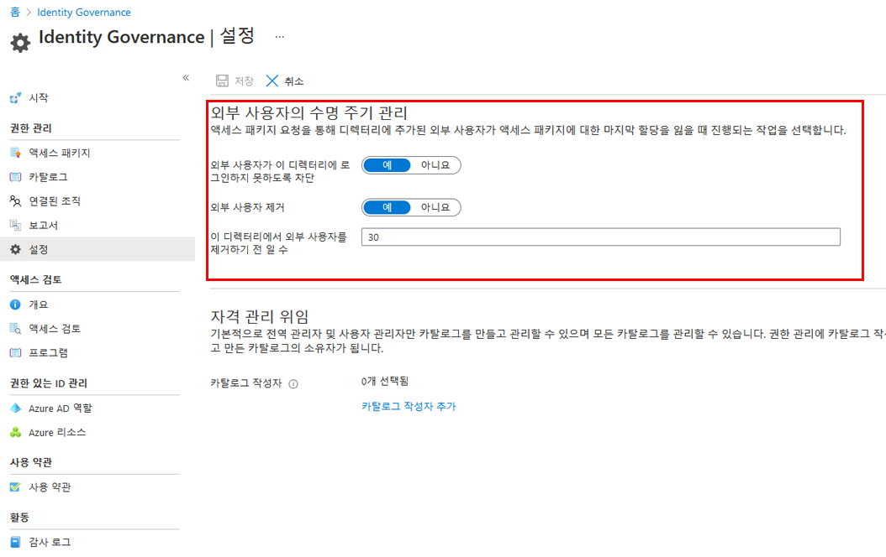

---
lab:
    title: '27 - Azure AD ID 거버넌스 설정에서 외부 사용자의 수명 주기 관리'
    learning path: '04'
    module: '모듈 01 - 권한 관리 계획 및 구현'
---

# 랩 27: Azure AD Identity Governance 설정에서 외부 사용자의 수명 주기 관리  

## 랩 시나리오

승인된 액세스 패키지 요청을 통해 디렉터리에 초대된 외부 사용자가 더 이상 액세스 패키지 할당을 보유하지 않는 경우 수행할 작업을 선택할 수 있습니다. 사용자가 모든 액세스 패키지 할당을 포기하거나 마지막 액세스 패키지 할당이 만료되는 경우 발생할 수 있습니다. 외부 사용자에게 더 이상 액세스 패키지 할당이 없는 경우 기본값으로 디렉터리에 로그인하지 못하도록 차단됩니다. 30일 후에는 해당 게스트 사용자 계정이 디렉터리에서 제거됩니다.

#### 예상 시간: 5분

## Azure AD Identity Governance 설정에서 외부 사용자의 수명 주기 관리

1. 전역 관리자로 [https://portal.azure.com](https://portal.azure.com)에 로그인합니다.

1. 해당 작업을 완료하려면 전역 관리자 또는 사용자 관리자 권한이 있는 계정이 필요합니다.

1. Azure Active Directory를 열고 **ID 거버넌스**를 선택합니다.

1. 왼쪽 탐색 메뉴의 **권한 관리**에서 **설정**을 선택합니다.

1. 상단 메뉴에서 **편집**을 선택합니다.

    

1. **외부 사용자의 수명 주기 관리** 섹션에서 외부 사용자에 대한 다양한 설정을 검토합니다.

1. 외부 사용자가 액세스 패키지에 대한 마지막 할당을 상실한 경우 이 디렉터리에 로그인하지 못하도록 차단하려면 **외부 사용자가 이 디렉터리에 로그인하지 못하도록 차단**을 **예**로 설정합니다.

1. 사용자가 디렉터리에 로그인하지 못하도록 차단되면 사용자는 액세스 패키지를 다시 요청하거나 해당 디렉터리에서 추가 액세스를 요청할 수 없습니다. 나중에 사용자가 다른 액세스 패키지에 대한 액세스를 요청해야 하는 경우 로그인을 차단하도록 구성하면 안 됩니다.

1. 외부 사용자가 액세스 패키지에 대한 마지막 할당을 상실한 후 이 디렉터리에서 게스트 사용자 계정을 제거하려면 **외부 사용자 제거**를 **예**로 설정합니다.

    > **참고** - 권한 관리는 권한 관리를 통해 초대된 계정만 제거합니다. 또한 액세스 패키지 할당이 아닌 디렉터리의 리소스에 사용자가 추가된 경우에도 사용자는 로그인하지 못하도록 차단되며 디렉터리에서 제거됩니다. 게스트는 액세스 패키지 할당을 받기 전에 이 디렉터리에 있는 경우 유지됩니다. 그러나 게스트가 액세스 패키지 할당을 통해 초대되고 초대된 후에 비즈니스용 OneDrive 또는 SharePoint Online 사이트에 할당된 경우에도 제거됩니다.

1. 해당 디렉터리에서 게스트 사용자 계정을 제거하려면 제거 전 일 수를 설정할 수 있습니다. 액세스 패키지에 대한 마지막 할당을 잃는 즉시 게스트 사용자 계정을 제거하려면 해당 디렉터리에서 **외부 사용자를 제거하기 전까지 남은 일 수**를 **0**으로 설정합니다.

1. 변경한 경우 **저장**을 선택합니다.
