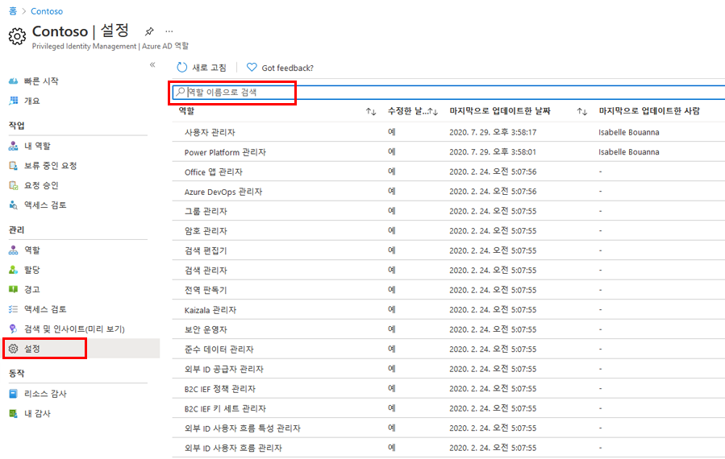
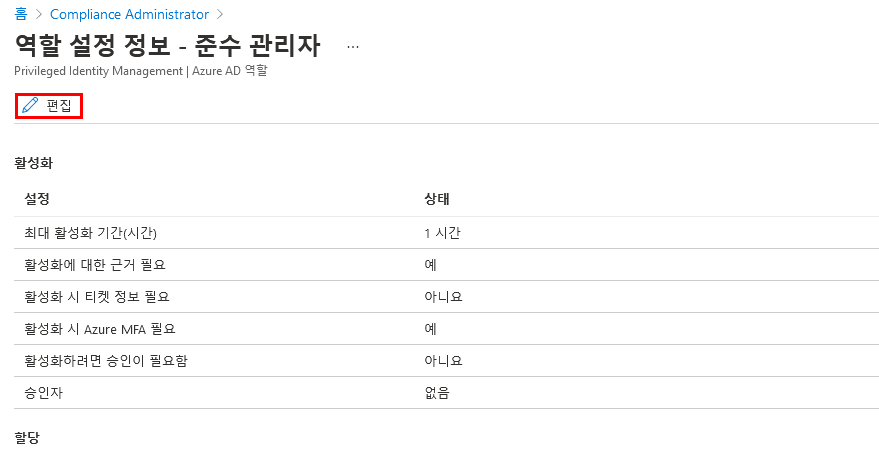
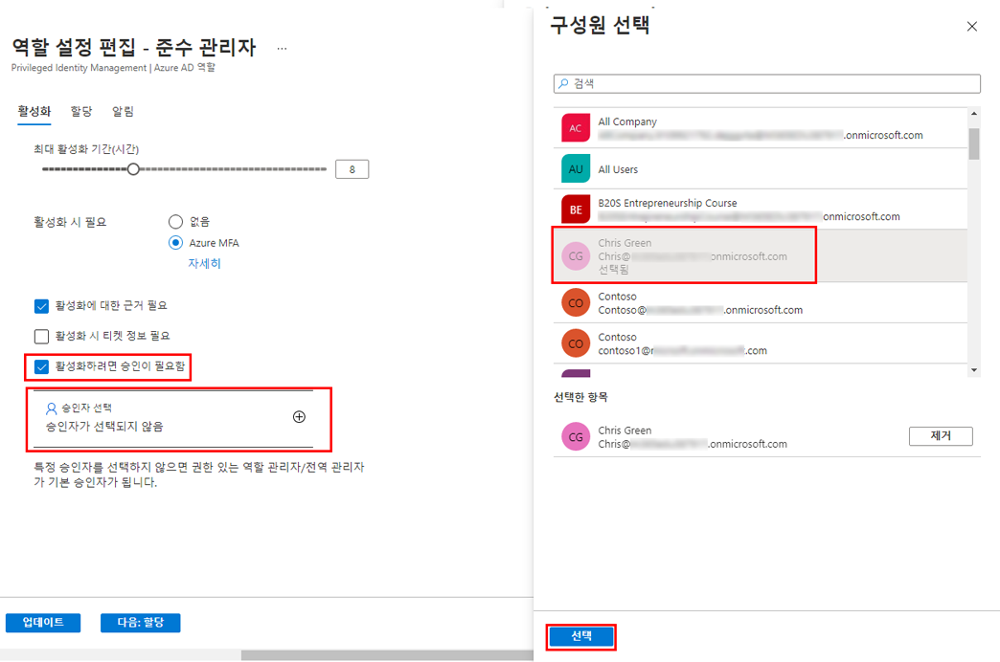

---
lab:
    title: '28 - Azure AD 역할에 대한 Privileged Identity Management 구성'
    learning path: '04'
    module: '모듈 03 - 권한 있는 액세스 계획 및 구현'
---

# 랩 28: Azure AD 역할에 대한 Privileged Identity Management 구성

## 랩 시나리오

권한 있는 역할 관리자는 적격 역할 할당을 활성화한 사용자의 환경을 변경하는 등 Azure Active Directory(Azure AD) 조직에서 PIM (Privileged Identity Management)을 사용자 지정할 수 있습니다. PIM을 구성하는 데 익숙해져야 합니다.

#### 예상 시간: 15분

## Azure AD 역할 설정 구성

### 역할 설정 열기

다음 단계에 따라 Azure AD 역할에 대한 설정을 엽니다.

1. 전역 관리자로 [https://portal.azure.com](https://portal.azure.com)에 로그인합니다.

1. 검색한 다음 **Azure AD Privileged Identity Management**를 선택합니다.

1. 왼쪽 탐색 영역에서 Privileged Identity Management 블레이드의 **Azure AD 역할**을 선택합니다.

1. 빠른 시작 페이지의 왼쪽 탐색 영역에서 **설정**을 선택합니다.

    

1. 역할 목록을 검토한 다음 **역할 이름으로 검색**에서 **준수**를 입력합니다.

1. 결과에서 **준수 관리자**를 선택합니다.

1. 역할 설정 세부 정보를 검토합니다.

### 활성화할 승인 필요

여러 승인자를 설정하는 경우 승인자 중 한 명이 승인되거나 거부되는 즉시 승인이 완료됩니다. 두 명 이상의 사용자에게 승인을 요구할 수 없습니다. 역할을 활성화하기 위해 승인을 요구하려는 경우 다음 단계를 따릅니다.

1. 역할 설정 정보 페이지의 상단 메뉴에서 **편집**을 선택합니다.

    

1. 역할 편집 설정 – 준수 관리자 블레이드에서 **활성화 승인 필요** 확인란을 선택합니다.

1. **승인자 선택**을 선택합니다.

1. 구성원 선택 창에서 관리자 계정을 선택한 다음 **선택**을 선택합니다.

    

1. 역할 설정을 구성하면, **업데이트**를 선택해 변경 사항을 저장합니다.
