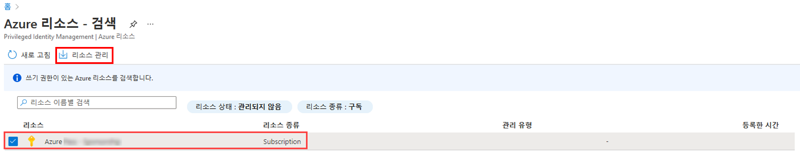
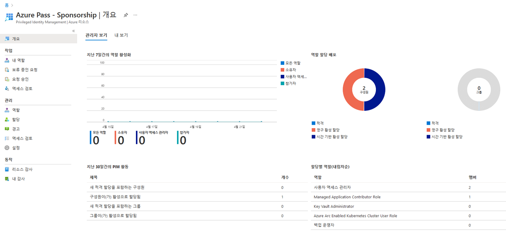

---
lab:
    title: '30 - Privileged Identity Management에서 Azure 리소스 역할 할당'
    learning path: '04'
    module: '모듈 03 - 권한 있는 액세스 계획 및 구현'
---

# 랩 30: Privileged Identity Management에서 Azure 리소스 역할 할당

## 랩 시나리오

Azure Active Directory(Azure AD) PIM(Privileged Identity Management)는 사용자 지정 역할 뿐만 아니라 기본 제공 Azure 리소스 역할을 관리할 수 있습니다(다음을 포함하되 국한되지 않음).

- 소유자

- 사용자 액세스 관리자

- 참가자

- 보안 관리자

- 보안 관리자

사용자를 Azure 리소스 역할에 대해 적격 사용자로 지정해야 합니다.

#### 예상 시간: 10분

## Azure 리소스 역할 할당

1. 전역 관리자 계정을 사용하여 [https://portal.azure.com](https://portal.azure.com)에 로그인합니다.

2. 검색한 다음 **Azure AD Privileged Identity Management**를 선택합니다.

3. 왼쪽 탐색 영역의 Privileged Identity Management 블레이드에서 **Azure 리소스**를 선택합니다.

4. 상단 메뉴에서 **리소스 검색**을 선택합니다.

5. Azure 리소스 – 검색 블레이드에서 구독을 선택한 다음, 상단 메뉴에서 **리소스 관리**를 선택합니다.

    

6. **관리용으로 선택한 리소스 온보딩** 대화 상자에서 정보를 검토한 다음 **확인**을 선택합니다.

7. 온보딩이 완료되면 Azure 리소스 – 검색 블레이드를 닫습니다.

8. Azure 리소스 블레이드에서 방금 추가한 리소스를 선택합니다.

    

9. 왼쪽 탐색 메뉴의 **관리**에서 **역할**을 선택하여 Azure 리소스에 대한 역할 목록을 표시합니다.

10. 상단 메뉴에서 **+ 할당 추가**를 선택합니다.

11. 할당 추가 블레이드에서 **역할 선택** 메뉴를 선택한 다음 **API Management 서비스 기여자**를 선택합니다.

12. **구성원 선택** 아래에서 **선택한 구성원이 없음**을 선택합니다.

13. 역할을 할당할 조직 사용자인 **Miriam Graham**을 선택합니다.  그런 후에 **선택**을 선택합니다.

14. **다음**을 선택합니다.

15. **설정** 탭의 **할당 유형**에서 **적격**을 선택합니다.

    - **적격** 할당에는 역할을 사용하는 작업을 수행하기 위해 역할의 멤버가 필요합니다. 작업은 MFA(Multi-Factor Authentication) 검사를 수행하고, 비즈니스 근거를 제공하거나 지정된 승인자의 승인을 요청하는 과정을 포함할 수 있습니다.

    - **활성** 할당에는 역할을 사용하는 작업을 수행하기 위해 멤버가 필요하지 않습니다. 활성으로 할당된 구성원에게는 역할에 할당된 권한이 있습니다.

16. 시작 및 종료 날짜와 시간을 변경하여 할당 기간을 지정합니다.

17. 작업을 마쳤으면 **할당**을 선택합니다.

18. 새 역할 할당이 만들어지면 상태 알림이 표시됩니다.

## 기존 리소스 역할 할당 업데이트 또는 제거

기존 역할 할당을 업데이트하거나 제거하려면 다음 단계를 수행합니다.

1. **Azure AD Privileged Identity Management**를 엽니다.

2. **Azure 리소스**를 선택합니다.

3. 관리하려는 리소스를 선택하여 개요 페이지를 엽니다.

4. **관리**에서 **할당**을 선택합니다.

5. 작업 열의 **적격 역할** 탭에서 사용 가능한 옵션을 검토합니다.

6. **제거**를 선택합니다.

7. **제거** 대화 상자에서 정보를 검토한 다음 **예**를 선택합니다.
