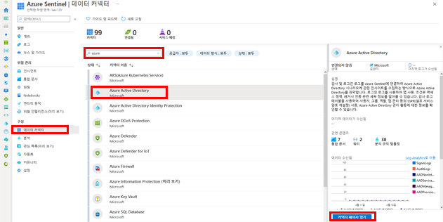
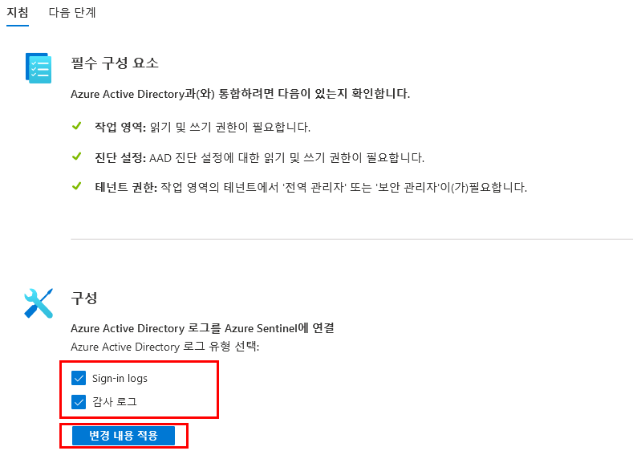

---
lab:
    title: '31 - Azure Active Directory(Azure AD)에서 Azure Sentinel로 데이터 연결'
    learning path: '04'
    module: '모듈 04 - Azure Active Directory 모니터링 및 유지 관리'
---

# 랩 31: Azure Active Directory(Azure AD)에서 Azure Sentinel로 데이터 연결

## 랩 시나리오

회사에서 SIEM(Security Information and Event Management) 솔루션을 사용하기 시작할 예정입니다. 현재 Azure Sentinel에 액세스할 수 있는데, 앞으로 Azure Sentinel을 Azure AD에 연결하는 데 익숙해져야 합니다.

#### 예상 시간: 10분

## 사전 요구 사항

- 모든 Azure AD 라이선스(Free/O365/P1/P2)는 Azure Sentinel로 로그인 로그를 수집하기에 충분합니다. Azure Monitor(Log Analytics)와 Azure Sentinel에 대해 기가바이트 당 요금이 추가 적용될 수 있습니다.

- 작업 영역에서 사용자에게 Azure Sentinel Contributor 역할을 할당해야 합니다.

- 사용자에게 로그를 스트리밍할 테넌트의 전역 관리자 또는 보안 관리자 역할이 할당되어야 합니다.

- 연결 상태를 볼 수 있으려면 사용자에게 Azure AD 진단 설정에 대한 읽기 및 쓰기 권한이 있어야 합니다.

## Azure Sentinel 작업 영역 만들기 및 추가

Azure Sentinel에 사용할 수 있는 작업 영역이 아직 없는 경우 다음 지침을 사용합니다.

1. 전역 관리자 계정을 사용하여 [https://portal.azure.com](https://portal.azure.com)에 로그인합니다.

2. **Azure Sentinel**을 검색하여 선택합니다.

3. Azure Sentinel 작업 영역 블레이드의 메뉴에서 **+ 만들기**를 선택합니다.

4. Azure Sentinel 작업 영역이 이미 있는 경우 해당 작업 영역을 선택하고 다음 작업을 계속할 수 있습니다.

5. 작업 영역에 Azure Sentinel 추가 블레이드에서 **새 작업 영역 생성**을 선택합니다.

6. 다음 정보를 사용하여 새 로그 분석 작업 영역을 만들 수 있습니다.

    | 설정| 값|
    | :--- | :--- |
    | 구독| 현재의 구독을 사용합니다.|
    | 리소스 그룹| 기존 리소스 그룹을 사용하거나 새 리소스 그룹을 만듭니다.|
    | 이름| **Lab-workspace-yourinitialsanddate** 작업 영역은 전역적으로 고유한 값이어야 합니다.|
    | 가격 책정 계층| 종량제(GB당 2018) |

7. **검토 + 만들기**를 선택합니다.
8. **유효성 검사 통과** 메시지가 표시되면 **만들기**를 선택합니다.

9. 완료되면 새 작업 영역을 선택하고 **추가**를 선택하여 Azure Sentinel에 작업 영역을 추가합니다.

## Azure Active Directory에 연결

Azure Sentinel의 기본 제공 커넥터를 사용하여 [https://docs.microsoft.com/ko-kr/azure/active-directory/fundamentals/active-directory-whatis](https://docs.microsoft.com/ko-kr/azure/active-directory/fundamentals/active-directory-whatis)에서 데이터를 수집하고 Azure Sentinel로 스트리밍할 수 있습니다. 커넥터를 사용하여 [https://docs.microsoft.com/ko-kr/azure/active-directory/reports-monitoring/concept-sign-ins](https://docs.microsoft.com/ko-kr/azure/active-directory/reports-monitoring/concept-sign-ins) and [https://docs.microsoft.com/ko-kr/azure/active-directory/reports-monitoring/concept-audit-logs](https://docs.microsoft.com/ko-kr/azure/active-directory/reports-monitoring/concept-audit-logs)를 스트리밍할 수 있습니다.

1. Azure Sentinel의 왼쪽 탐색 메뉴에 있는 **구성** 아래에서 **데이터 커넥터**를 선택합니다.

1. **데이터 커넥터** 목록에서 **Azure Active Directory**를 선택한 다음 **커넥터 페이지 열기**를 선택합니다.

    

1. **구성**에서 **Azure Active Directory 로그인 로그** 및 **감사 로그** 확인란을 선택하고 **변경 내용 적용**을 선택합니다.

    

1. Microsoft Azure Active Directory 커넥터 페이지를 닫습니다.
